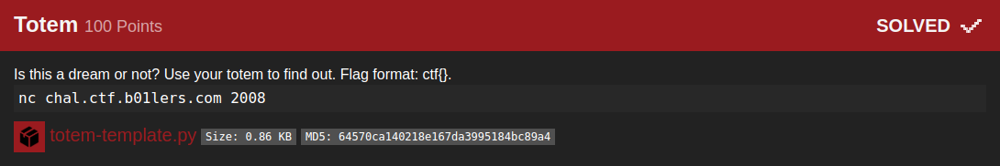

## B01lers_CTF(Totem)

_**Oct 3-4, 2020**_

<br>


<h3 id="Challenge Description">Challenge Description</h3>



> Is this a dream or not? Use your totem to find out. Flag format: ctf{}.
> nc chal.ctf.b01lers.com 2008

<br>

<h3 id="Solution">Solution</h3>

the server provide us with a ciphertext and the encoding method, the idea is to decode the cipher text with the given cipher, thens send it back to the server, in a consent loop untill we get the flag

This was the server Flow :
```
nc -v chal.ctf.b01lers.com 2008
Ncat: Version 7.80 ( https://nmap.org/ncat )
Ncat: Connected to 104.197.187.199:2008.
Method: atbash
Ciphertext: kzirh
Input: paris
Method: Base64
Ciphertext: ZXh0cmFjdGluZw==
Input: extracting
Method: rot13
Ciphertext: chyyrq
Input: pulled
Method: Base64
Ciphertext: d2FyZWhvdXNl
Input: warehouse
Method: bacon
Ciphertext: AABBBABAAAAABBAAABBBAABAABAABABAABB
Input: highest
```

and this is the script to pull the flag out:
```python
import socket
import re
import string
import base64
from pwn import *

# Baconian cipher
def bacon2text(bacon):
    bacondict = {}
    plaintext = "" 
    bacon = bacon.lower()
    bacon = re.sub("[\W\d]", "", bacon.strip())
    for i in range(0,26):
        tmp = bin(i)[2:].zfill(5)
        tmp = tmp.replace('0', 'a')
        tmp = tmp.replace('1', 'b')
        bacondict[tmp] = chr(65+i)
    k = len(bacon)/5
    k = int(k)
    for i in range(0, k):
        plaintext = plaintext + bacondict.get(bacon[i*5:i*5+5], ' ')
    return plaintext.lower()
 

# Rot13
def rot13(s):
    result = ""
    for v in s:
        c = ord(v)
        if c >= ord('a') and c <= ord('z'):
            if c > ord('m'):
                c -= 13
            else:
                c += 13
        elif c >= ord('A') and c <= ord('Z'):
            if c > ord('M'):
                c -= 13
            else:
                c += 13
        result += chr(c)
    return result

# Atbash
ENCODE_TABLE = str.maketrans(
    string.ascii_letters,
    ''.join(reversed(string.ascii_lowercase + string.ascii_lowercase)),
    string.punctuation + string.whitespace)
DECODE_TABLE = str.maketrans(
    string.ascii_lowercase,
    ''.join(reversed(string.ascii_lowercase)),
    string.whitespace)
    
def atbash(encryptedstring):
    return encryptedstring.translate(DECODE_TABLE)

#base64
def b64dcd(base64_message):
    base64_bytes = base64_message.encode('ascii')
    message_bytes = base64.b64decode(base64_bytes)
    message = message_bytes.decode('ascii')
    return message

io = remote('chal.ctf.b01lers.com', 2008)
txt = ''
try:

    if "ctf{" not in txt:
        while True:
            #print("[+] Receiving Data.")
            cipher_ = io.recvline()
            data_ = io.recvline()

            #print("[+] Converting Data.")
            cipher = cipher_.decode('utf-8').split() # We only need to check for the cipher type nothing more.
            data = data_.decode('utf-8').split()[1] # we need the accurate cipher.

            if 'rot13' in cipher:
                print("Decoding rot13  : %s" %data)
                txt = rot13(data)
                print("Result          : %s" %txt)
                print("[*] Sending Result.")
                io.sendline(txt)

            elif 'bacon' in cipher:
                print("Decoding bacon  : %s" %data)
                txt = bacon2text(data)
                print("Result          : %s" %txt)
                print("[*] Sending Result.")
                io.sendline(txt)

            elif 'atbash' in cipher:
                print("Decoding atbash : %s" %data)
                txt = atbash(data)
                print("Result          : %s" %txt)
                print("[*] Sending Result.")
                io.sendline(txt)

            elif 'Base64' in cipher:
                print("Decoding base64 : %s" %data)
                txt = b64dcd(data)
                print("Result          : %s" %txt)
                print("[*] Sending Result.")
                io.sendline(txt)

            else:
                # Just For Debugging purposes
                print(cipher_)
                print(data_)
                break
    else:
        print("\n\n[*] Flag Detected :")
        print(" %s"%txt)
        print(" %s"%cipher_)
        print(" %s"%data_)

except EOFError:
    print(" %s"%txt)
    print(" %s"%cipher_)
    print(" %s"%data_)
```


The result :
```
m3dsec@local:~/b01lers.com/crypto/05_Totem_$ python3 totem2.py 
[*] Opening connection to chal.ctf.b01lers.com on port 2008: Done
[*] Sending Result.
Decoding atbash : zggvmgrlm
Result          : attention
[*] Sending Result.
Decoding base64 : YWx3YXlz
Result          : always
...
[*] Sending Result.
 always
 b"Input: We must be dreaming, here's your flag: ctf{4n_313g4nt_s01ut10n_f0r_tr4cking_r341ity}\n"
 b'Ciphertext: YWx3YXlz\n'

```


<br>
<br>

best regards, [m3dsec](https://github.com/m3dsec)

--------------

[back to B01lers_CTF()](../../ctf/b01lers.md)

[back to main()](../../../index.md)

