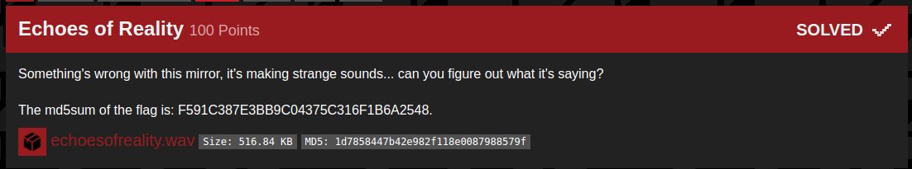
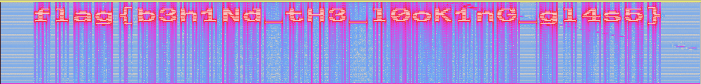

## B01lers_CTF(echoes_of_reality)

_**Oct 3-4, 2020**_

 

<h3 id="Challenge Description">Challenge Description</h3>

> Something's wrong with this mirror, it's making strange sounds... can you figure out what it's saying? 
> echoesofreality.wav
> Size: 516.84 KB 
> MD5: 1d7858447b42e982f118e0087988579f

 

<h3 id="Solution">Solution</h3>

In this challenge we have a .wav file when we play it, it's just scratch and garbage in the back. There must be something in the spectrogram :

 
 

best regards, 

[bvr0n](https://linkedin.com/in/taha-el-ghadraoui-5921771a5)

--------------

[back to B01lers_CTF()](../../ctf/b01lers.md)

[back to main()](../../../index.md)

