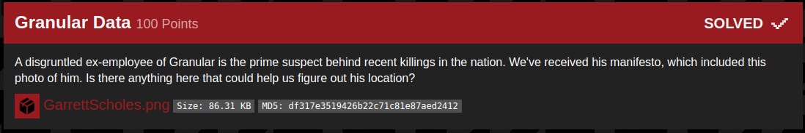

## B01lers_CTF(granular_data)

_**Oct 3-4, 2020**_

<br>


<h3 id="Challenge Description">Challenge Description</h3>



> A disgruntled ex-employee of Granular is the prime suspect behind recent killings in the nation. We've received his manifesto, which included this photo of him. Is there anything here that could help us figure out his location?


<h3 id="Solution">Solution</h3>

In this challenge we have a .png image, let's check the meta-data :

```
bvr0n@kali:~/CTF/b01lers_bootcamp/Misc$ exiftool GarrettScholes.png 
ExifTool Version Number         : 12.06
File Name                       : GarrettScholes.png
Directory                       : .
File Size                       : 86 kB
File Modification Date/Time     : 2020:10:03 09:16:29-04:00
File Access Date/Time           : 2020:10:03 09:17:03-04:00
File Inode Change Date/Time     : 2020:10:03 09:17:00-04:00
File Permissions                : rw-r--r--
File Type                       : PNG
File Type Extension             : png
MIME Type                       : image/png
Image Width                     : 400
Image Height                    : 400
Bit Depth                       : 8
Color Type                      : RGB with Alpha
Compression                     : Deflate/Inflate
Filter                          : Adaptive
Interlace                       : Noninterlaced
XMP Toolkit                     : Adobe XMP Core 6.0-c002 79.164460, 2020/05/12-16:04:17
Authors Position                : Software Engineer
Creator                         : Garrett Scholes
Title                           : Cute Selfie
Creator City                    : flag{h4t3d_1n_th3_n4t10n_0MTBu}
Creator Country                 : United Kingdom
Image Size                      : 400x400
Megapixels                      : 0.160
```


The Creator City have the flag :)
```
FLAG : flag{h4t3d_1n_th3_n4t10n_0MTBu}
```

<br>
<br>

best regards, 

[bvr0n](https://linkedin.com/in/taha-el-ghadraoui-5921771a5)

--------------

[back to B01lers_CTF()](../../ctf/b01lers.md)

[back to main()](../../../index.md)

