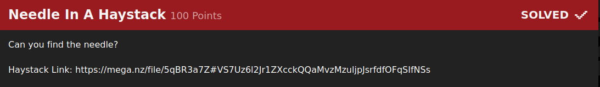

## B01lers_CTF(Needle_In_A_Haystack)

_**Oct 3-4, 2020**_

<br>


<h3 id="Challenge Description">Challenge Description</h3>



> Can you find the needle?
> Haystack Link: https://mega.nz/file/5qBR3a7Z#VS7Uz6l2Jr1ZXcckQQaMvzMzuljpJsrfdfOFqSIfNSs

<br>

<h3 id="Solution">Solution</h3>

In this challenge we have a .zip file let's grabe it and unzip it :
```
bvr0n@kali:~/CTF/b01lers_bootcamp/Misc$ unzip haystack.zip
```
After unziping it we get a folder that have 400 .txt file inside, each file have a lot of Data, let's try to get the flag in a smarter way :
```
bvr0n@kali:~/CTF/b01lers_bootcamp/Misc/NeedleInAHayStack$ strings * | grep -oE flag{.*}
flag{y0u_f0unD_Th3_n33d1e!}
```

<br>
<br>

best regards, 

[bvr0n](https://linkedin.com/in/taha-el-ghadraoui-5921771a5)

--------------

[back to B01lers_CTF()](../../ctf/b01lers.md)

[back to main()](../../../index.md)
