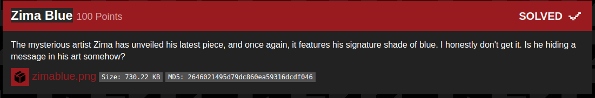
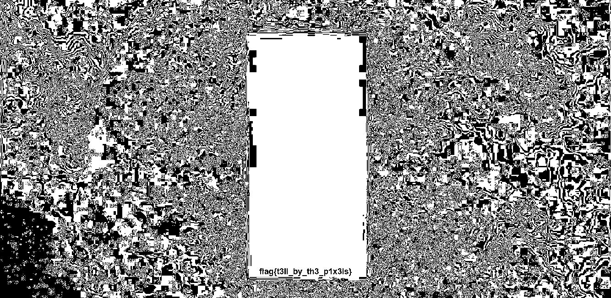

## B01lers_CTF(zima_blue)

_**Oct 3-4, 2020**_

<br>


<h3 id="Challenge Description">Challenge Description</h3>



> The mysterious artist Zima has unveiled his latest piece, and once again, it features his signature shade of blue. I honestly don't get it. Is he hiding a message in his art somehow?
> [zimablue.png](../../../assets/resource/zimablue-2646021495d79dc860ea59316dcdf046.png)
> Size: 730.22 KB
> MD5: 2646021495d79dc860ea59316dcdf046

<br>

<h3 id="Solution">Solution</h3>

In this challenge we had a .png image, after opening the image we saw a blue rectangle inside, my guess was the flag is inside the blue area, Let's get it with StegoSolve :

A bit After playing with the image we get out flag 



```
FLAG : flag{t3ll_by_th3_p1x3ls}
```


<br>
<br>

best regards, 

[bvr0n](https://linkedin.com/in/taha-el-ghadraoui-5921771a5)

--------------

[back to B01lers_CTF()](../../ctf/b01lers.md)

[back to main()](../../../index.md)

