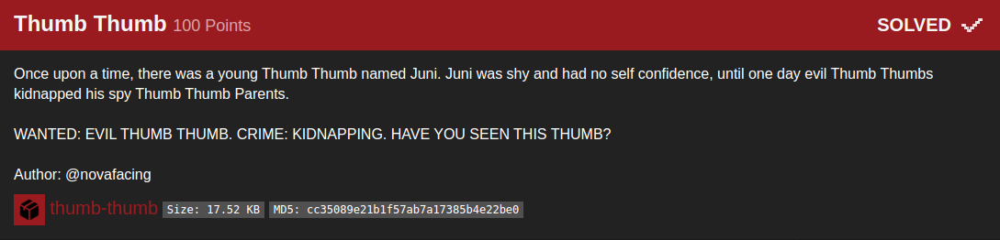

## B01lers_CTF(Totem)

_**Oct 3-4, 2020**_

<br>


<h3 id="Challenge Description">Challenge Description</h3>



> Once upon a time, there was a young Thumb Thumb named Juni. Juni was shy and had no self confidence, until one day evil Thumb Thumbs kidnapped his spy Thumb Thumb Parents.
> WANTED: EVIL THUMB THUMB. CRIME: KIDNAPPING. HAVE YOU SEEN THIS THUMB?
> Author: @novafacing

<br>

<h3 id="Solution">Solution</h3>

Running the binary doesnt give mush, lets analyze the binary :

```
m3dsec@local:~/03_Thumb_Thumb_$ file thumb-thumb 
thumb-thumb: ELF 64-bit LSB shared object, x86-64, version 1 (SYSV), dynamically linked, interpreter /lib64/ld-linux-x86-64.so.2, BuildID[sha1]=7d12de256b1d51589dde8bdde0ecb74d89baf6bb, for GNU/Linux 3.2.0, not stripped
```

reversing the binary give us multiple function sitting on main :

```c
undefined8 main(void)
{
  thumblings_assemble();
  thumblings_engage();
  thumblings_attack();
  thumblings_retreat();
  return 0;
}
```

but `thumblings_assemble()` function looks interesting, it contain some variables, holding hexadecimal values that need to be decoded.
```c
void thumblings_assemble(void)

{
  long in_FS_OFFSET;
  int local_7c;
  undefined4 local_78 [26];
  long local_10;
  
  local_10 = *(long *)(in_FS_OFFSET + 0x28);
  local_78[0] = 0x66;
  local_78[21] = 0x75;
  local_78[4] = 0x7b;
  local_78[7] = 0x6e;
  local_78[9] = 0x5f;
  local_78[10] = 0x30;
  local_78[15] = 0x33;
  local_78[22] = 0x6d;
  local_78[12] = 0x72;
  local_78[13] = 0x5f;
  local_78[14] = 0x62;
  local_78[17] = 0x74;
  local_78[8] = 100;
  local_78[18] = 0x5f;
  local_78[11] = 0x75;
  local_78[19] = 0x74;
  local_78[6] = 0x33;
  local_78[1] = 0x6c;
  local_78[2] = 0x61;
  local_78[3] = 0x67;
  local_78[5] = 0x73;
  local_78[20] = 0x68;
  local_78[23] = 0x62;
  local_78[16] = 0x73;
  local_78[24] = 0x35;
  local_78[25] = 0x7d;
  local_7c = 0;
  while (local_7c < 0x1a) {
    local_78[local_7c] = 0;
    local_7c = local_7c + 1;
  }
  if (local_10 != *(long *)(in_FS_OFFSET + 0x28)) {
                    /* WARNING: Subroutine does not return */
    __stack_chk_fail();
  }
  return;
}
```

I used this one liner to grab all those variables, sort them ,then decode them with python using the chr() method.

```
m3dsec@local:~/03_Thumb_Thumb_/src$ cat thumblings_assemble.c|grep local_78|awk -F '[' '{print $2}'|sort -h -k 1|grep -v local|awk -F '=' '{print $2}'|cut -c2-|tr -d ';'|grep .|while read i;do python3 -c "print(chr($i))";done|tr -d '\n';echo
flag{s3nd_0ur_b3st_thumb5}
```

<br>
<br>

best regards, [m3dsec](https://github.com/m3dsec)

--------------

[back to B01lers_CTF()](../../ctf/b01lers.md)

[back to main()](../../../index.md)

