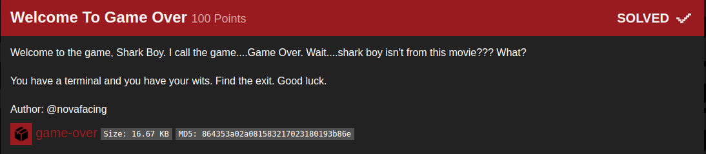

## B01lers_CTF(welcome_to_game_over)

_**Oct 3-4, 2020**_

<br>


<h3 id="Challenge Description">Challenge Description</h3>



> Welcome to the game, Shark Boy. I call the game....Game Over. Wait....shark boy isn't from this movie??? What?
> You have a terminal and you have your wits. Find the exit. Good luck.
> Author: @novafacing

<br>

<h3 id="Solution">Solution</h3>

Running the file at first sight we get some output:
```
m3dsec@local:~/b01lers.com/rev/04_Welcome_To_Game_Over$ ./game-over 

sharkboy@gameover > ./getemail.sh
I was fired.                          
I know.
I hacked into the O.S.S. data files and saw the news.
It was probably my fault, I suppose.
I am sorry.
```

after reversing the program using ghidra we can spot the main function, that contain :

```c
void main(void)

{
  puts("\nsharkboy@gameover > ./getemail.sh");
  fflush(stdout);
  flashprint("**** INCOMING MESSAGE FROM CARMEN ****",700,5);
  funprint(
           "I was fired.\nI know.\nI hacked into the O.S.S. data files and saw the news.\nIt wasprobably my fault, I suppose.\nI am sorry."
           ,300);
  _my_little_thumbling("flag{welc0me_to_th3_game<FIND_THE_REST_OF_THE_FLAG_IN_FUNCTION_NAMES>}");
  return;
}
```
we can spot the 1st part of the flag `flag{welc0me_to_th3_game`, the rest was the function name `_my_little_thumbling`

and, we got the flag !!

`flag{welc0me_to_th3_game_my_little_thumbling`

<br>
<br>

best regards, [m3dsec](https://github.com/m3dsec)

--------------

[back to B01lers_CTF()](../../ctf/b01lers.md)

[back to main()](../../../index.md)

