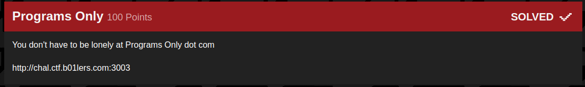
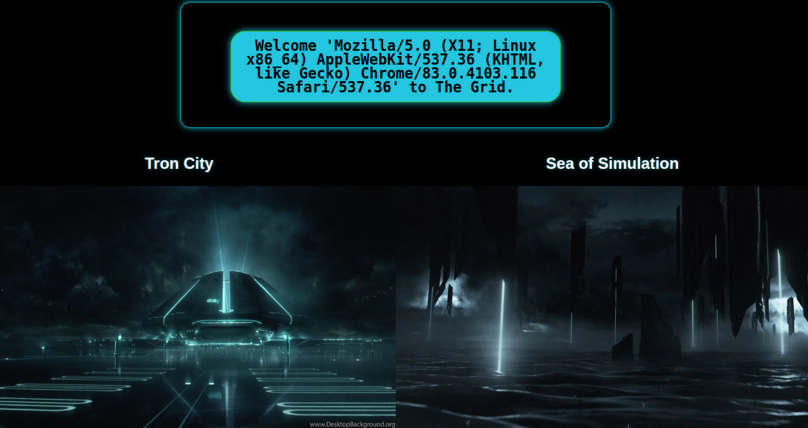
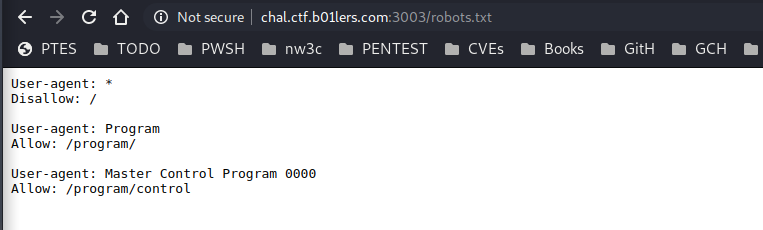

## B01lers_CTF(programs_only)

_**Oct 3-4, 2020**_

<br>


<h3 id="Challenge Description">Challenge Description</h3>



> You don't have to be lonely at Programs Only dot com.
> http://chal.ctf.b01lers.com:3003


<br>

<h3 id="Solution">Solution</h3>

First look on the index page



Inspecting the source code we noticed multiple comments, the most interesting one is:

```html
<!--
        <div>
<a href="/program">
<h2>Program's Only</h2>

          </a>
        </div>
-->
```

Visiting `/program` we get **access denied**, I had this idea that i need a specific **user-agent** to get access into `/program` route, this is where i start sending curl requests with a bunch of diffrent user-agents hoping that i can get a diffrent response

```
$ find /usr/share/seclists/|grep -i agent|grep -i bot|while read i;do cat $i|while read x;do echo $x; curl http://chal.ctf.b01lers.com:3003/program -H "User-Agent: $x"; done; done
```

but when i checked the `/robots.txt` file, i got some valuable informations:




Once Changing the User-agent value to `Master Control Program 0000`, we gave `/program/control` a visite, and 


Bingo, We got the flag !!

<br>
<br>

best regards, [m3dsec](https://github.com/m3dsec)

--------------

[back to B01lers_CTF()](../../ctf/b01lers.md)

[back to main()](../../../index.md)

