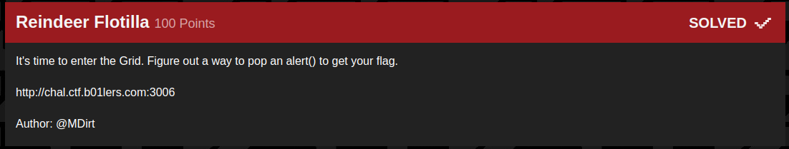

## B01lers_CTF(Reindeer_Flotilla)

_**Oct 3-4, 2020**_

<br>


<h3 id="Challenge Description">Challenge Description</h3>



> It's time to enter the Grid. Figure out a way to pop an alert() to get your flag.
> http://chal.ctf.b01lers.com:3006


<br>

<h3 id="Solution">Solution</h3>

At first look we notice that it's XSS related, so let's pop an `alert()`

executing this basic payload will give us a flag back :

```js

```

FLAG : `flag{y0u_sh0uldnt_h4v3_c0m3_b4ck_flynn}`


<br>
<br>

best regards

[bvr0n](https://linkedin.com/in/taha-el-ghadraoui-5921771a5)

--------------

[back to B01lers_CTF()](../../ctf/b01lers.md)

[back to main()](../../../index.md)

