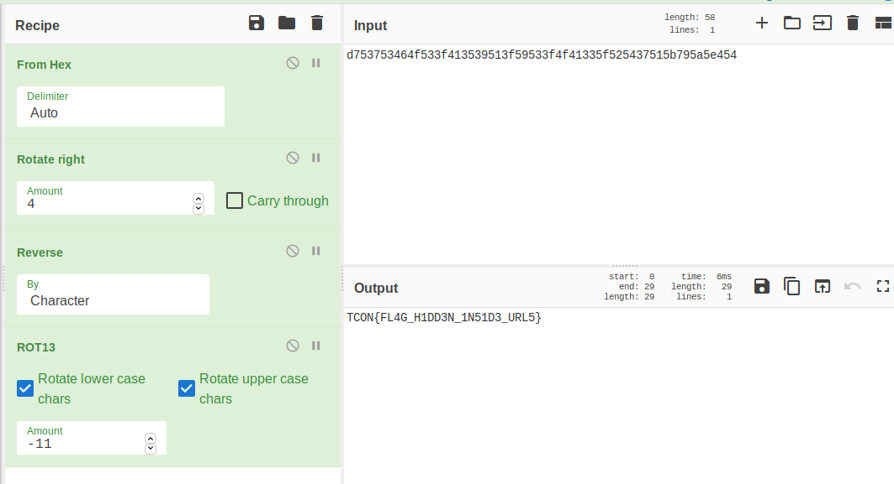

## RESTHACKER_CTF() - dumpster diving 1.

_**Aug 29, 2020**_

<br>

## Challange Description

>Restcon users are solving a CTF Challenge and got fed up too soon can you solve it - `firefox.zip`


<br>

### How We Solve it :


Great, look like we have some firefox profiles to inspect, leets dump the content with dumpzilla

```sh
dumpzilla x2p79maw.default-esr/ --History
```

we see some web requests beying sent to cyberchef engine
```sh
https://gchq.github.io/CyberChef/#recipe=ROT13(true,true,11)To_Hex('Space',0)&input=ZDc1Mzc1MzQ2NGY1MzNmNDEzNTM5NTEzZjU5NTMzZjRmNDEzMzVmNTI1NDM3NTE1Yjc5NWE1ZTQ1NDQ0MDUzNA
```

and it seems like the user was trying to decode that cypher 
```sh
d753753464f533f413539513f59533f4f41335f525437515b795a5e454
```

<br>
we can give it a try on cyberchef :)

- From Hex : `×Su4dõ3ô.S..õ.3ôô.5õ%Cu.·.¥äT`
- Rotat Right : `}5WCF_3O15Y1_Y3OO1S_R4WQ{YZNE`
- Reverse it : `ENZY{QW4R_S1OO3Y_1Y51O3_FCW5}`
- Rot13(-11) : `TCON{FL4G_H1DD3N_1N51D3_URL5}`
- Final Flag : `RESTCON{FL4G_H1DD3N_1N51D3_URL5}`



<br>
best regards

[m3dsec](https://twitter.com/m3dsec).

<br>
<br>

[back to RESTHACKER_CTF](../../ctf/resethacker.md)

[back to main()](../../../index.md)

<br>
<br>