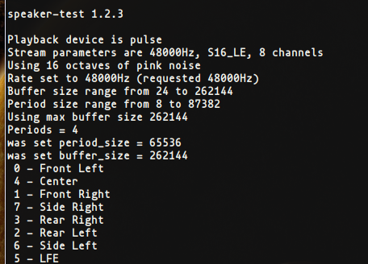
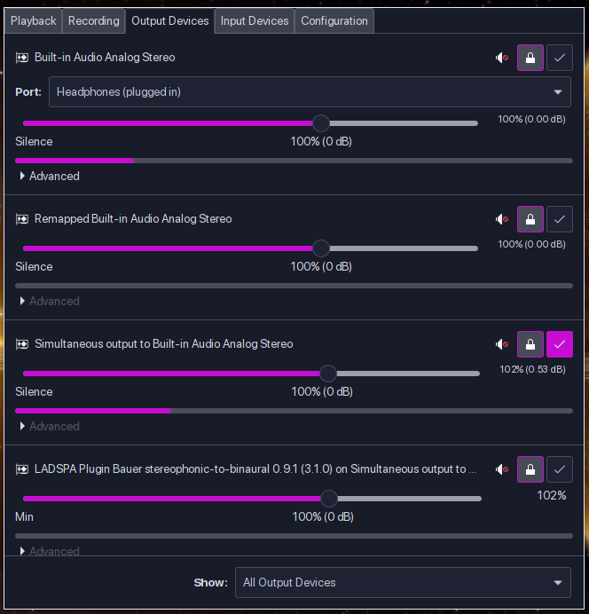
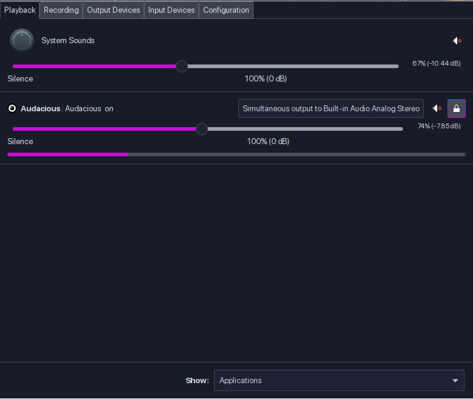
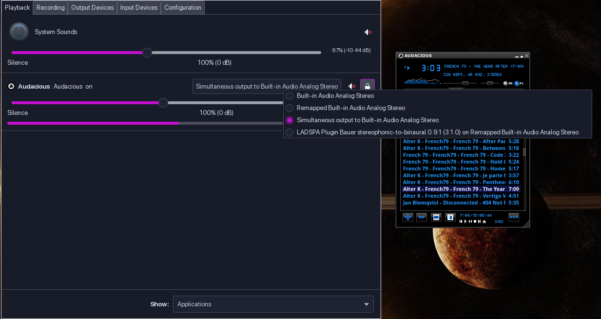
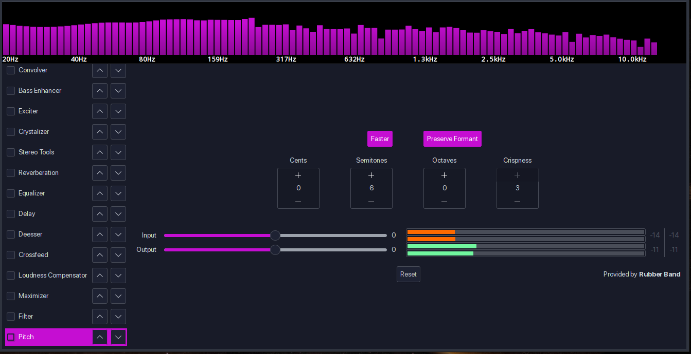
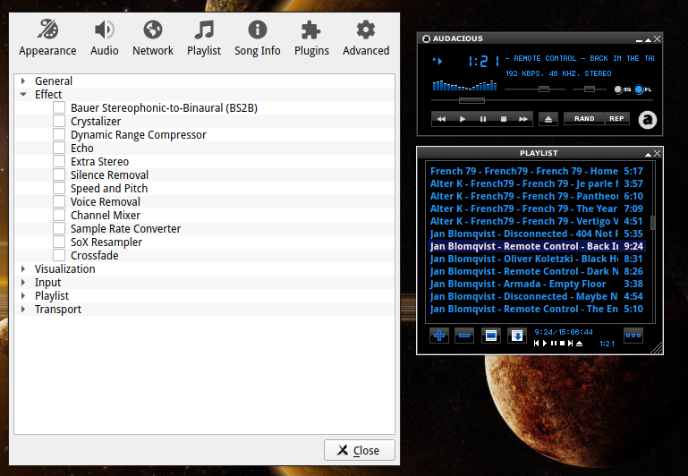

_**Sep 23, 2020**_

# Surrounded Sound System In Pulse Audio

<h2 id="Introduction">Introduction</h2>

For many of you who are music nerds and look to enjoy music / movies / audio clips in a surrounded sound system this guide is right for you.
Unfortunately if dolby supported linux we wouldn't all this but it's a good practice to understand how pulse audio works and discover new ways of mixing up audio, so let's get started !

## Body:

Now before we start configuring pulse audio we need some *Requirments*.
- Headset / Headphones Supports 5.1 / 7.1 Surround Sound
- 7.1 / 5.1 Surround Sound Speaker System

If your headphones / Headset / whatever you are trying doesn't support 5.1 / 7.1 surround sound , you won't be able to notice any change, now we gonna start by testing our headphones/speakers.

`speaker-test -D default -c 8` Now this will test if our device has 8 channel output (7.1) or 6 channel output (5.1), mine goes something like this.



**Note**: If you only see 2 output channels that means your device doesn't support 7.1/5.1 surround sound or it set to use only 2 channel output (it comes by default with pulse audio).

Now let's create our config file located in `~/.config/pulse/daemon.conf` if pulse directory doesn't exists just create a new one and now we will create daemon.conf and open it with some text editor and add the values below.

```
default-sample-format = float32le
default-sample-rate = 48000
alternate-sample-rate = 44100
default-sample-channels = 8
default-channel-map = front-left,front-right,rear-left,rear-right,front-center,lfe,side-left,side-right
default-fragments = 2
default-fragment-size-msec = 125
resample-method = soxr-vhq
enable-lfe-remixing = yes
high-priority = yes
nice-level = -11
realtime-scheduling = yes
realtime-priority = 9
rlimit-rtprio = 9
daemonize = no
```

`default-sample-format` is sampling format it depends on the endianness of the cpu, to check your cpu byte order `lscpu | grep 'Byte Order'` if it's little endian just live the config as it is, if it's big endian replace float32le with float32be.

`default-sample-rate` is the sample frequency , `alternate-sample-rate` the alternate sample frequency. Sinks and sources will use either the default-sample-rate value or this alternate value, typically 44.1 or 48kHz.

`default-sample-channels` number of channels if you have 5.1 surround sound system change the value to (6)

`default-channel-map` the channel map if you're on 5.1 surround sound system use this `front-left,front-right,rear-left,rear-right,front-center,lfe`

`resample-method` sample rate converter best to leave it as soxr very high quality all available converters are in (man pulse-daemon.conf) , for comparison benchmarks [Here](https://lastique.github.io/src_test/)

`daemonize` daemonize after start up default is no.

<br>

**Note**: don't change the following value , the following settings prevent glitches & drop-outs during playback

`default-fragments` hardware playback buffer subdivided into fragments default was (4)

`default-fragment-size-msec`duration of single fragment default was (25ms)

`high-priority` set as high priority process default to yes (Don't change)

`enable-lfe-remixing` if disabled upmixing or downmixing ignore lfe channel (Not Recommended To Disable)

`nice-level` default -11, lowest value allowed: (20 - rlimit-nice), lower means more CPU-%

`realtime-scheduling` default is yes (don't change)

`rlimit-rtprio` default 9, values from -20 upto 19 allowed

`realtime-priority` default 5, highest value allowed: rlimit-rtprio, higher means more priority

<br>

Now let's add asla config (**/etc/asound.conf** or **~/.asoundrc**), nothing really here to explain we just using **hw** plugin to work with pulse audio

```
# Use PulseAudio plugin hw
pcm.!default {
   type plug
   slave.pcm hw
}
```


Now let's list our devices with (`pacmd list-sinks | grep "name:"`) and the output should be something like this

```
name: <alsa_output.pci-0000_00_1b.0.analog-surround71>
```


**Note**: it can be more than one device depends and what you're connecting to your workstation.

Then will copy default.pa config from (**/etc/pulse/default.pa** to **~/.config/pulse/**)

Now we need to install a quick module `ladspa-bs2b` and `libbs2b`

```
  In Arch Linux (AUR)
yay -S libbs2b

  In Debian / Ubuntu
apt install bs2b-ladspa

  Other Distros (Got No Idea)

```

Now let's load the modules, open default.pa in ~/.config/pulse and add the following lines at the bottom

- For 7.1 Surround Sound System

```
load-module module-remap-sink sink_name=Remape remix=yes master=alsa_output.pci-0000_00_1b.0.analog-surround71 channels=8 master_channel_map=rear-left,rear-right,front-left,front-right,front-center,lfe,side-left,side-right channel_map=front-left,front-right,rear-left,rear-right,front-center,lfe,side-left,side-right
load-module module-combine channels=8 channel_map=front-left,front-right,rear-left,rear-right,front-center,lfe,side-left,side-right
load-module module-ladspa-sink sink_name=Ybenel plugin=bs2b label=bs2b control=700,4.5
```

- For 5.1 Surround Sound System

```
load-module module-remap-sink sink_name=Remape remix=yes master=alsa_output.pci-0000_00_1b.0.analog-surround71 channels=6 master_channel_map=front-left,front-right,rear-left,rear-right,front-center,lfe channel_map=front-left,front-right,rear-left,rear-right,front-center,lfe
load-module module-combine channels=8 channel_map=front-left,front-right,rear-left,rear-right,front-center,lfe
load-module module-ladspa-sink sink_name=Ybenel plugin=bs2b label=bs2b control=700,4.5
```

<br>

There's another module that creates a virtual surround sink but it requires a hrir file , lucky you i found a good pack that has alot of samples

Download the archive from [Here](https://stuff.salscheider.org/hrir_listen.tar.gz) unzip it and listen to the demos choose what you like and load the module

<br>

- This is just an example replace the hrir path and file of your like

```
load-module module-virtual-surround-sink hrir=/home/ybenel/Music/surround/hrir_listen/hrirs/hrir-1038.wav
```

Now we need to restart pulse audio

```
  Kill pulse audio
pulseaudio --kill
  In case pulse audio didn't start
pulseaudio --start
```

Now let's open pavucontrol , if it's not installed in your os , it's recommended to install it.

In the output tab you should see the modules are loaded .



Go Back To The Playback Tab And You'll see currently running apps and you'll see the sink device that it's been used just click it and you'll see all available output options , choose what's looks good in ur case





**Extra**: If you're looking for some real time effects to add , you could use ``pulseeffects`` to mix , equalize , compress , whatever




Other Cool Thing is Audacious Player That Has Some Really Good Plugins



## Conclusion

Pulse Audio Is Really not bad and It's much less complicated than alsa it only needs some configurations and little tweaking and it's great again.

<br>
<br>

[Ybenel](https://github.com/r2dr0dn).

<br>
<br>

[back to main()](../../index.md)

<br>
<br>
